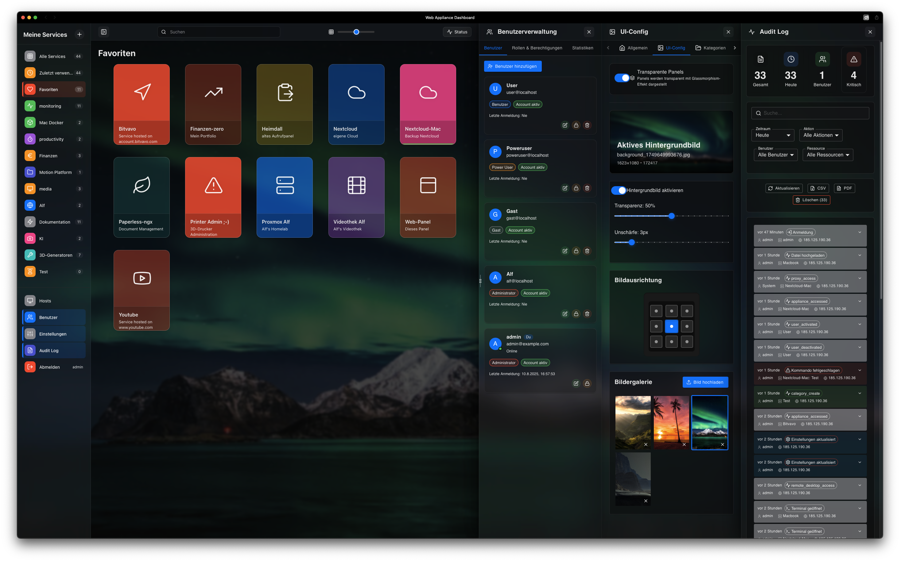
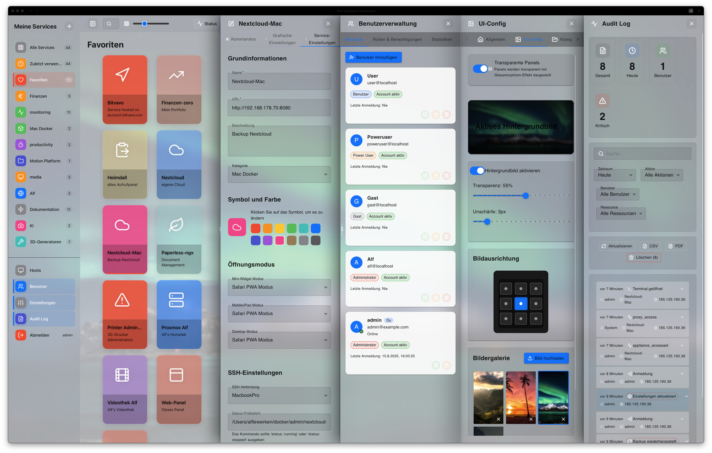
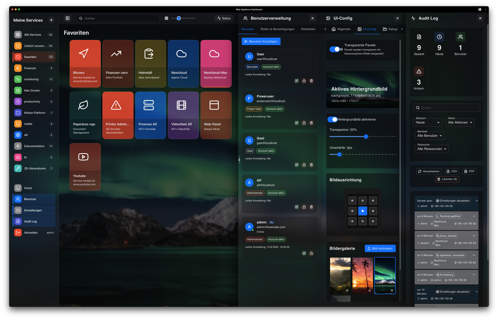
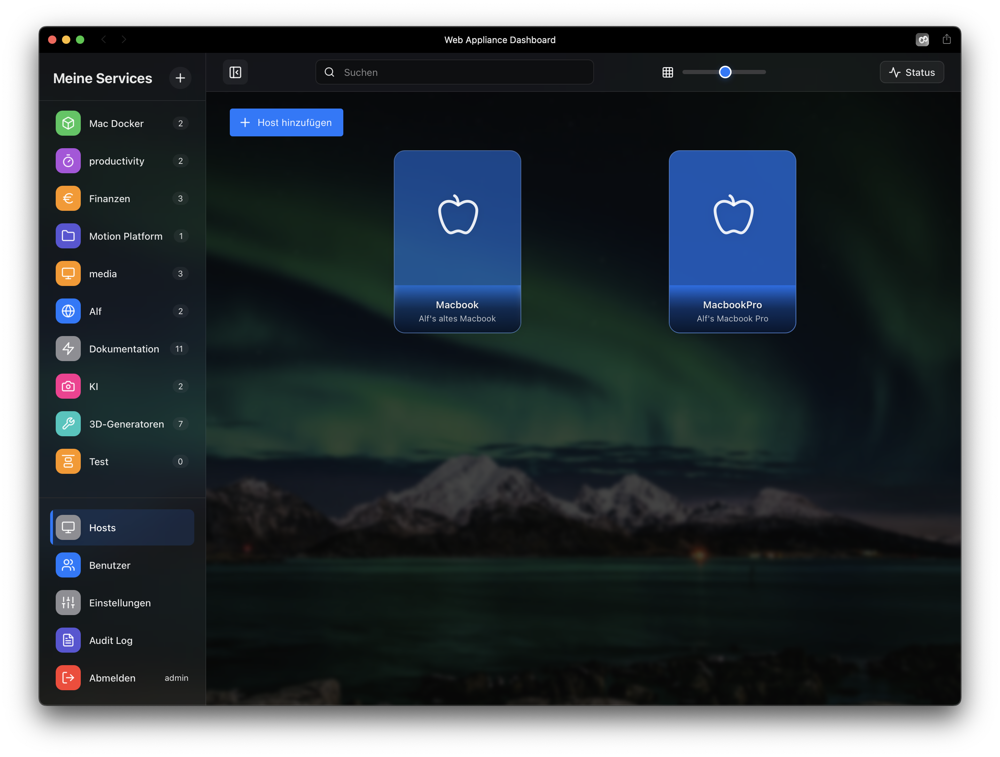
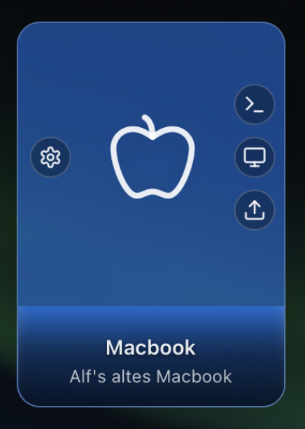
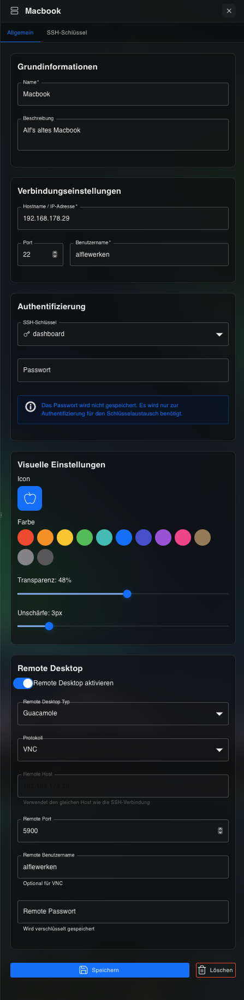
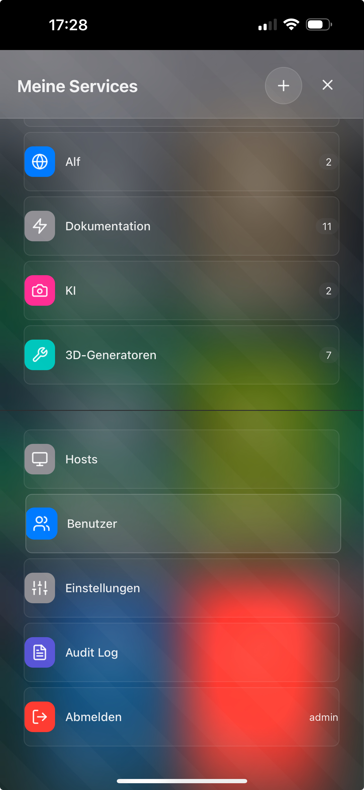
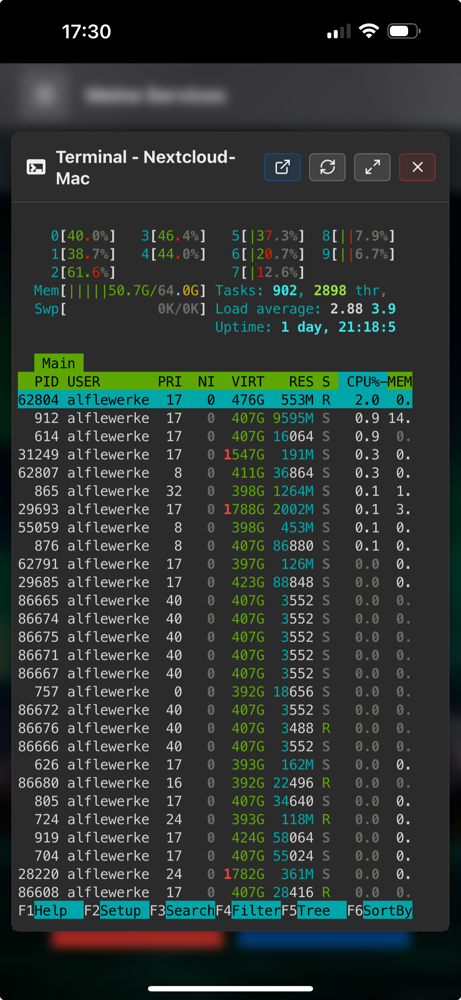
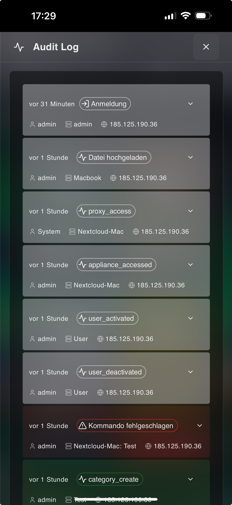
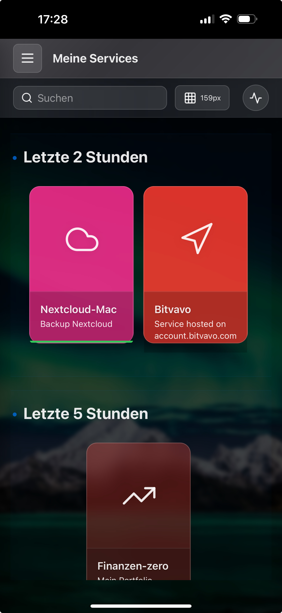

# Web Appliance Dashboard 🚀

[🇬🇧 English](README.md) | 🇩🇪 Deutsch | [📖 Benutzerhandbuch](docs/user-guide-v2/USER-GUIDE.md)

[](https://www.docker.com/)
[](https://nodejs.org/)
[](https://reactjs.org/)
[](https://expressjs.com/)
[](LICENSE)
[](package.json)
[](frontend/public/locales)
[](SECURITY.md)

<!-- Dynamische GitHub Badges -->
[](https://github.com/alflewerken/web-appliance-dashboard/issues)
[](https://github.com/alflewerken/web-appliance-dashboard/pulls)
[](https://github.com/alflewerken/web-appliance-dashboard/commits/main)
[](https://github.com/alflewerken/web-appliance-dashboard/actions)

## ⭐ Unterstützen Sie das Projekt

Wenn Sie dieses Projekt nützlich finden, geben Sie ihm bitte einen Stern! Das hilft anderen, das Projekt zu entdecken und motiviert die weitere Entwicklung.

<div align="center">

[](https://github.com/alflewerken/web-appliance-dashboard/stargazers)
[](https://github.com/alflewerken/web-appliance-dashboard/network)
[](https://github.com/alflewerken/web-appliance-dashboard/watchers)

</div>

> **"Von einem Homelab-Enthusiasten für Homelab-Enthusiasten"**

Schluss mit dem Tab-Chaos! Ein einziges Dashboard für all Ihre Server, Services und Container. Greifen Sie per Web-Terminal auf Ihre Systeme zu, nutzen Sie Remote-Desktop direkt im Browser, überwachen Sie den Health-Status in Echtzeit. Alles selbst-gehostet, verschlüsselt und unter Ihrer Kontrolle - wie ein Homelab sein sollte.



### 🎨 Light & Dark Modus

<div align="center">
<table>
<tr>
<td align="center"><b>Light Modus</b></td>
<td align="center"><b>Dark Modus</b></td>
</tr>
<tr>
<td></td>
<td></td>
</tr>
</table>
</div>

## 🌟 Features

### Core Features
- **📊 Zentrales Dashboard** - Übersichtliche Verwaltung aller Services und Hosts
- **🔐 Authentifizierung** - JWT-basierte Benutzerverwaltung mit Rollen (Admin/User)
- **🖥️ Web Terminal** - Integriertes Terminal über ttyd mit SSH-Key Support
- **🔑 SSH Integration** - Vollständiges SSH-Key Management mit automatischer Authentifizierung
- **🖥️ Remote Desktop** - VNC & RDP Support über Apache Guacamole
- **📦 Service Control** - Start/Stop/Status von Services über SSH
- **🎨 Clean UI Philosophy** - "Hover-to-Reveal" (Desktop), "Touch-to-Show" (Mobile)
- **📱 Mobile First** - PWA-fähig, optimiert für iPhone und Tablets

### Enterprise Features
- **💾 Backup & Restore** - Komplette Systemsicherung mit Verschlüsselung
- **📝 Audit Logging** - Compliance-fähig mit Undo-Funktion
- **⚡ Echtzeit-Updates** - Server-Sent Events (SSE) für Live-Status
- **🛡️ Sicherheit** - Rate Limiting, CORS, Helmet.js, CSP
- **🌐 Multi-User** - Benutzerverwaltung mit granularem Rechtesystem (in Entwicklung)
- **🔍 Volltextsuche** - Schnelle Suche über alle Services
- **💡 Smart Categories** - Automatische Gruppierung mit Service-Counter

## 📸 Screenshots

<details>
<summary><b>Alle Screenshots anzeigen</b></summary>

### Dashboard Übersicht

*Desktop Dashboard mit Clean UI*

### Host-Verwaltung

*Host-Übersicht mit allen angelegten Rechnern*


*Host-Karte mit Hover-to-Reveal Buttons*


*Detaillierte Host-Konfiguration*

### Mobile Experience

*iPhone Dashboard Ansicht*


*SSH Terminal auf dem iPhone*


*Audit Log mobil - Compliance-fähig*


*Kategorien mit Service-Counter*

</details>

## 🤔 Warum noch ein Dashboard?

<details>
<summary><b>Seien wir ehrlich - es gibt viele Dashboard-Lösungen da draußen. Warum also habe ich noch eines gebaut?</b></summary>

### Das Problem, das ich hatte

Nach dem Ausprobieren von Portainer, Heimdall, Homer und unzähligen anderen, endete ich immer mit denselben Frustrationen:

- **🔌 Zu viele Browser-Tabs** - Jeder Service hatte seine eigene UI, was zu Tab-Chaos führte
- **🔑 Passwort-Müdigkeit** - Unterschiedliche Anmeldedaten für jeden einzelnen Service
- **📱 Schlechte Mobile-Erfahrung** - Die meisten Dashboards sind nur nachträgliche Desktop-Gedanken
- **☁️ Cloud-Abhängigkeiten** - Viele benötigen externe Services oder Phone-Home-Features
- **🎨 Hässliche oder veraltete UIs** - Seien wir ehrlich, die meisten sehen aus wie von 2010
- **🔧 Überentwickelt** - Einfache Aufgaben erfordern komplexe Konfigurationen

### Meine Lösung

Ich habe das Web Appliance Dashboard gebaut, um **MEINE** Probleme zu lösen - und vielleicht sind es auch Ihre:

✅ **Ein Dashboard für Alles** - Terminal, Remote Desktop, Docker, Services - alles an einem Ort  
✅ **Mobile-First Design** - Zuerst für iPhone gebaut, skaliert wunderbar auf Desktop  
✅ **Keine Cloud-Abhängigkeiten** - Ihre Daten bleiben auf IHRER Hardware  
✅ **Moderne, saubere UI** - Hover-to-Reveal-Philosophie hält alles aufgeräumt  
✅ **Ein-Zeilen-Installation** - Weil das Leben zu kurz für komplexe Setups ist  
✅ **Tatsächlich nützlich** - Jedes Feature existiert, weil ich es brauchte, nicht weil es cool zu bauen war

**Das ist nicht nur ein weiteres Dashboard - es ist das Dashboard, das ich mir gewünscht hätte.**

</details>

## 🏆 Vergleich mit Anderen

| Funktion | Web Appliance Dashboard | Portainer | Heimdall | Homer |
|---------|------------------------|-----------|----------|--------|
| Ein-Zeilen-Installation | ✅ | ❌ | ❌ | ❌ |
| Web Terminal | ✅ Integriert | ❌ | ❌ | ❌ |
| Remote Desktop | ✅ Integriert | ❌ | ❌ | ❌ |
| Mobile Optimiert | ✅ Mobile-First | ⚠️ | ❌ | ❌ |
| Dark Mode | ✅ | ✅ | ✅ | ✅ |
| SSH Verwaltung | ✅ Vollständig | ❌ | ❌ | ❌ |
| Service-Steuerung | ✅ | ⚠️ | ❌ | ❌ |
| Cloud-Frei | ✅ | ✅ | ✅ | ✅ |
| Moderne UI | ✅ React 19 | ⚠️ | ❌ | ⚠️ |
| Backup/Restore | ✅ Verschlüsselt | ❌ | ❌ | ❌ |


## 🚀 Schnellstart - Ein-Zeilen-Installation

Installieren Sie das komplette Dashboard mit einem einzigen Befehl:

```bash
curl -sSL https://raw.githubusercontent.com/alflewerken/web-appliance-dashboard/main/install.sh | bash
```

Das war's! Der Installer wird:
- ✅ Docker-Voraussetzungen prüfen
- ✅ Alle Konfigurationsdateien herunterladen
- ✅ Sichere Passwörter automatisch generieren
- ✅ SSL-Zertifikate erstellen
- ✅ Alle Container herunterladen und starten
- ✅ Die Datenbank einrichten

Nach der Installation erreichen Sie Ihr Dashboard unter:
- 🌐 **http://localhost:9080**
- 🔒 **https://localhost:9080** (selbst-signiertes Zertifikat)

## 🗑️ Vollständige Deinstallation

Um das Web Appliance Dashboard komplett zu entfernen:

```bash
# Zum Installationsverzeichnis wechseln
cd ~/web-appliance-dashboard

# Alle Container, Volumes und Netzwerke stoppen und entfernen
docker compose down -v

# Installationsverzeichnis entfernen
cd ~ && rm -rf web-appliance-dashboard

# Optional: Docker Images entfernen
docker images | grep ghcr.io/alflewerken | awk '{print $3}' | xargs docker rmi -f
```

Dies entfernt:
- Alle Container
- Alle Volumes (inklusive Daten)
- Alle Netzwerke
- Alle Konfigurationsdateien
- Alle Docker Images (optional)

## 🔄 Update

> ⚠️ **WICHTIG: Vor dem Update immer ein Backup über die Web-Oberfläche erstellen!**
> 
> Navigieren Sie zu **Einstellungen → Backup** im Dashboard und erstellen Sie ein vollständiges Backup.
> Dies stellt sicher, dass Sie Ihre Konfiguration und Daten bei Bedarf wiederherstellen können.

```bash
# Zum Installationsverzeichnis wechseln
cd ~/web-appliance-dashboard

# Neueste Docker-Images ziehen und neu starten
docker compose pull
docker compose up -d
```

Das war's! Das Dashboard wird automatisch auf die neueste Version aktualisiert.

### Update-Hinweise
- Datenbank-Migrationen laufen automatisch beim Start
- Ihre Daten und Konfigurationen bleiben erhalten
- Versionsänderungen finden Sie im [CHANGELOG.md](https://github.com/alflewerken/web-appliance-dashboard/blob/main/CHANGELOG.md)

## 📚 Dokumentation

### 📖 Für Benutzer
- **[Benutzerhandbuch](docs/user-guide-v2/USER-GUIDE.md)** - Umfangreiche Anleitung mit persönlicher Note
  - Entstehungsgeschichte & Motivation
  - 5-Minuten-Schnellstart (Host-First!)
  - Mobile Experience Guide
  - Praktische Workflows
  - Clean UI Philosophie

### Entwickler-Dokumentation
- [Developer Guide](docs/developer.html) - Architektur mit Diagrammen
- [API-Referenz](docs/api-reference-ger.md) - API-Dokumentation
- [API Client SDKs](docs/api-client-sdks-ger.md) - Client-Beispiele
- [Integrations-Guide](docs/integration-guide-ger.md) - Integration in bestehende Systeme
- [Entwicklungsumgebung](docs/DEVELOPMENT_SETUP-ger.md) - Entwicklungsumgebung einrichten

### Technische Dokumentation
- [Backend Proxy Implementierung](docs/BACKEND_PROXY_IMPLEMENTATION-ger.md) - Proxy-Architektur
- [OpenAPI Spezifikation](docs/openapi.yaml) - API-Spezifikation

## 🆕 Neueste Updates

### 🚀 Version 1.1.6 (27. August 2025) - Host-Monitoring & Audit-Log-Verbesserungen

#### Echtzeit Host-Monitoring
- ✅ **Host-Ping-Monitoring-System** - Live-Verfügbarkeitsverfolgung für alle Hosts
  - Automatische Ping-Checks in benutzerdefinierten Intervallen
  - Farbcodierte Statusbalken zeigen Verbindungsqualität (Grün/Gelb/Orange/Rot)
  - Echtzeit-Updates via Server-Sent Events an alle verbundenen Clients
  - Plattformübergreifende Unterstützung (Windows, macOS, Linux)
  - Parallele Ausführung mit intelligenter Concurrency-Limitierung
  - Synchronisiert mit Service-Status-Check-Intervallen aus den Einstellungen

#### Audit-Log-Verbesserungen
- ✅ **Interaktive Statistiken mit visuellem Feedback** - Erweiterte Filter-Karten
  - Aktive Filter zeigen prominente Glow-Effekte mit pulsierender Animation
  - "Aktive Benutzer"-Karte jetzt klickbar für benutzer-bezogene Aktionen
  - Dynamische Statistik-Updates basierend auf aktiven Filter-Kombinationen
  - Verbesserte visuelle Hierarchie mit mehrschichtigen Schatten

- ✅ **Erweiterte Datumsfilterung** - Korrigierte Einzeltages- und benutzerdefinierte Bereiche
  - Benutzerdefinierte Datumsbereiche umfassen jetzt vollständige Tage (00:00:00 bis 23:59:59)
  - Gestern-Filter deckt korrekt 24-Stunden-Zeitraum ab
  - Erweiterte Benutzer-Aktions-Erkennung für umfassende Filterung

- ✅ **Host-Wiederherstellungs-Details** - Benutzerfreundliche Datenanzeige
  - JSON-Strings durch organisierte Chip/Pillen-Layouts ersetzt
  - Gruppierte Informationen nach Kategorie (Basis, Verbindung, Visuell, Remote)
  - Farbcodierte Status-Indikatoren und visuelle Eigenschafts-Vorschauen

#### Fehlerbehebungen
- ✅ "No fields to revert"-Fehler beim Zurücksetzen von Host-Änderungen via Audit-Log behoben
- ✅ Audit-Log-Statistiken aktualisieren sich jetzt korrekt dynamisch mit Filtern
- ✅ Fehlende Logs bei Auswahl des gleichen Start-/End-Datums behoben
- ✅ SQL-Fehler in Host-Ping-Monitoring-Abfragen korrigiert

### 🎨 Version 1.1.5 (20. August 2025) - Großes Frontend-Refactoring

#### Komplette Komponenten-Modularisierung
- ✅ **AuditLog-Refactoring** - Monolithische 2800+ Zeilen Dateien in 8 fokussierte Module aufgeteilt
  - 83% Code-Reduktion in Hauptkomponenten (von 1465 auf 254 Zeilen)
  - Klare Trennung der Verantwortlichkeiten mit Single Responsibility Principle
  - Bessere Performance durch verbesserte Code-Splitting-Möglichkeiten
  - Module: Actions, Filters, Restore, Details, Stats, Export-Funktionalität
  
- ✅ **Komponenten-Organisation** - Umstrukturierung in logische Ordner
  - `components/SettingsPanel/` - 11 Settings-bezogene Komponenten
  - `components/Appliances/` - 19 Appliance-bezogene Komponenten
  - Named Exports via index.js für sauberere Imports
  - Komponenten und ihre CSS-Dateien jetzt zusammen

#### UI/UX-Verbesserungen
- ✅ **AuditLog Panel Resize** - Komplette Neuimplementierung
  - "Springendes Panel" Bug behoben (konnte nur 2-3 Pixel bewegt werden)
  - Flüssiges Resizing zwischen 400-1200px Breite
  - LocalStorage-Persistierung der Panel-Breite
  - Einfache useRef-Lösung ersetzt komplexes State-Management

#### Fehlerbehebungen
- ✅ **Dark Mode Tabellen** - Text-Sichtbarkeit in Modal/Dialog-Kontexten repariert
- ✅ **AuditLog Restore** - Wiederherstellen-Buttons erscheinen jetzt korrekt für alle Aktionen
- ✅ **Frontend-Updates** - Docker-Volume von read-only auf writable geändert
- ✅ **Namenskonventionen** - Durchgängig camelCase im gesamten Frontend durchgesetzt

#### Code-Qualität
- ✅ **Dead Code Eliminierung** - 16 ungenutzte Komponenten und CSS-Dateien entfernt
- ✅ **Code-Reduktion** - ~2000 Zeilen durch Modularisierung entfernt
- ✅ **Wartbarkeit** - Von 1400+ Zeilen Dateien zu ~200 Zeilen fokussierten Modulen
- ✅ **Testbarkeit** - Module können jetzt isoliert getestet werden

### 🔒 Version 1.1.4 (18. August 2025) - Sicherheits- & Infrastruktur-Überarbeitung

#### Wichtige Infrastruktur-Verbesserungen
- ✅ **SSH-Infrastruktur modernisiert** - Migration von Dateisystem zu Datenbank-basierter Key-Verwaltung
- ✅ **Einheitliche Verschlüsselungs-Architektur** - Konsistentes AES-256-GCM überall (ersetzt gemischtes GCM/CBC)
- ✅ **Backup/Restore komplett überarbeitet** - Automatische Re-Verschlüsselung, überlebt alle Restore-Zyklen
- ✅ **Guacamole-Integration perfektioniert** - Token-Authentifizierung funktioniert zuverlässig, keine Login-Dialoge
- ✅ **Build-Prozess verbessert** - Intelligente Credential-Wiederherstellung bei fehlender .env
- ✅ **Kritische Sicherheitsfixes** - Alle hartcodierten Passwörter entfernt, korrekte Verschlüsselung für Service-Passwörter

#### Technische Verbesserungen
- ✅ **Datenbank-basierte SSH-Keys** - StatusChecker und Commands nutzen DB-Keys direkt
- ✅ **Temporäre Key-Dateien** - Auto-Cleanup nach SSH-Operationen
- ✅ **Service-Passwort-Fix** - Von bcrypt (Einweg) zu reversibler Verschlüsselung gewechselt
- ✅ **Konsistente Re-Verschlüsselung** - Backup-Export/Import mit korrektem Key-Management
- ✅ **AuthTag-Validierung** - Vollständige 32-Zeichen authTag-Erhaltung
- ✅ **Container-Wiederherstellung** - Erkennt existierende Datenbanken ohne Datenverlust

#### Fehlerbehebungen
- ✅ Tomcat-Underscore-Problem in Service-Namen behoben
- ✅ Header-Auth blockiert nicht mehr Token-Auth
- ✅ Passwort-Korruption beim Backup behoben (6-Byte authTag-Bug)
- ✅ Integer-Vergleichsfehler in Build-Scripts korrigiert
- ✅ SSH-Verbindung von Containern zu Host-Systemen repariert

#### Installer-Verbesserungen
- ✅ **Platform-spezifische Fixes** - sed/awk Kompatibilität zwischen macOS und Linux gelöst
- ✅ **Python-basierte YAML-Verarbeitung** - Zuverlässige docker-compose.yml Modifikationen
- ✅ **Automatische Konfigurations-Reparatur** - Behebt häufige Probleme während der Installation
- ✅ **Bessere Fehlerbehandlung** - Klare Fehlermeldungen mit Lösungsvorschlägen

#### Technische Verbesserungen
- ✅ **Non-Interactive Mode** - Keine TTY-Fehler bei SSH-Installationen
- ✅ **Docker-Erkennung erweitert** - Findet Docker in /usr/local/bin (Docker Desktop)
- ✅ **Hostname-Erkennung** - Automatische .local Hostname-Unterstützung für macOS (Bonjour/mDNS)
- ✅ **Container-Namen Konsistenz** - Alle Container verwenden appliance_ Prefix

### 🚀 Version 1.1.3 (August 2025)
- ✅ **React 19 Kompatibilität** - Volle Unterstützung für React 19.1.1
- ✅ **Express 4 Stabilität** - Routing-Probleme gelöst, stabiles Backend
- ✅ **Verbessertes Backup/Restore** - Drag-and-Drop Funktionalität repariert
- ✅ **Remote Desktop repariert** - Guacamole Authentifizierung funktioniert
- ✅ **Erweiterte Dokumentation** - Prominente Backup-Warnungen vor Updates hinzugefügt

### 📖 Neues Benutzerhandbuch
- ✅ Umfassende Dokumentation mit 600+ Zeilen
- ✅ Persönliche Entstehungsgeschichte des Projekts
- ✅ Mobile-First Dokumentation mit iPhone Screenshots
- ✅ Praktische Workflows statt Feature-Listen
- ✅ Clean UI Philosophy dokumentiert

### UI/UX Verbesserungen
- ✅ Interaktive Tooltips für kollabierte Sidebar
- ✅ Toggle-Funktionalität für Sidepanels
- ✅ Verbesserte Resize-Funktionalität für Panels
- ✅ Kein horizontales Scrolling in der Sidebar

### Neue Features
- ✅ Verschlüsselungsschlüssel-Dialog nach Backup
- ✅ Guacamole Cache-Clear API Endpoint
- ✅ Verbesserte SSH-Host Update-Funktionalität
- ✅ Terminal Error Suppressor für saubere Konsole

### Bug Fixes
- ✅ Health Check Probleme behoben (ttyd, webserver)
- ✅ SSH File Upload bei 10% hängen behoben
- ✅ Hostname-Duplikat Check beim Update korrigiert
- ✅ Remote Desktop nach Logout funktioniert wieder

## 📋 Voraussetzungen

- Docker & Docker Compose (v2.0+)
- Linux/macOS/Windows mit WSL2
- 2GB RAM (4GB empfohlen)
- 10GB freier Speicherplatz

## 🛠️ Installationsmethoden

### Methode 1: Ein-Zeilen-Installation (Empfohlen)
Der einfachste Weg - siehe [Schnellstart](#-schnellstart---ein-zeilen-installation) oben.

### Methode 2: Manuelle Installation (für Entwicklung)

#### 1. Repository klonen
```bash
git clone https://github.com/alflewerken/web-appliance-dashboard.git
cd web-appliance-dashboard
```

#### 2. Bauen und starten
```bash
./scripts/build.sh --nocache
```

Dieser Befehl:
- ✅ Erstellt automatisch alle .env Dateien mit sicheren Passwörtern
- ✅ Baut die Frontend-Anwendung
- ✅ Erstellt und startet alle Docker-Container
- ✅ Richtet das Datenbankschema ein
- ✅ Konfiguriert alle Services

### 3. Dashboard öffnen
```
http://localhost:9080
```

Standard-Login:
- **Benutzer**: admin
- **Passwort**: admin123

⚠️ **Wichtig**: Ändern Sie das Standard-Passwort sofort!

### 4. Ersten Host anlegen
1. Klicken Sie auf "Hosts" in der Sidebar
2. "Host hinzufügen" anklicken
3. Host-Daten eingeben (IP, SSH-Zugangsdaten)
4. Speichern - fertig!

Ausführliche Anleitung: [📖 Benutzerhandbuch](docs/user-guide-v2/USER-GUIDE.md)

## 🔒 Sicherheit

### Integrierte Sicherheitsfunktionen
- **JWT-Authentifizierung** - Sichere Token-basierte Authentifizierung
- **Verschlüsselte Passwörter** - AES-256 für Remote-Host-Passwörter
- **Rate-Limiting** - Schutz vor Brute-Force-Angriffen
- **CORS-Schutz** - Konfigurierbare Richtlinien
- **SQL-Injection-Schutz** - Prepared Statements
- **XSS-Prävention** - Eingabebereinigung

### Wichtige Sicherheitshinweise

⚠️ **Verschlüsselungsschlüssel**: 
- Wird beim Setup generiert oder manuell eingegeben
- Sicher aufbewahren (z.B. Passwort-Manager)
- Benötigt für Passwort-Entschlüsselung nach Restore

⚠️ **Best Practices**:
- Alle Standard-Passwörter ändern
- HTTPS mit gültigem Zertifikat verwenden
- Regelmäßige Backups erstellen
- Firewall-Regeln konfigurieren

## 🏗️ Architektur

```
┌─────────────────┐     ┌─────────────────┐     ┌─────────────────┐
│ React Frontend  │────▶│  Nginx Proxy    │────▶│  Node.js API    │
│                 │     │   (Port 9080)   │     │   (Port 3001)   │
└─────────────────┘     └─────────────────┘     └─────────────────┘
                                                          │
                        ┌─────────────────┐               │
                        │   Web Terminal  │◀──────────────┤
                        │     (ttyd)      │               │
                        └─────────────────┘               │
                                                          │
                        ┌─────────────────┐               │
                        │    Guacamole    │◀──────────────┤
                        │   (VNC/RDP)     │               │
                        └─────────────────┘               │
                                                          │
                        ┌─────────────────┐               │
                        │    RustDesk     │◀──────────────┤
                        │  (Remote Desk)  │               │
                        └─────────────────┘               │
                                                          │
                        ┌─────────────────┐               │
                        │    MySQL DB     │◀──────────────┘
                        │   (Port 3306)   │
                        └─────────────────┘
```

## 🔧 Wartung

### Backup erstellen
```bash
# Über die UI: Einstellungen → Backup → Backup erstellen
# Oder via Script:
docker exec appliance_backend npm run backup
```

### Logs anzeigen
```bash
# Alle Services
docker compose logs -f

# Spezifischer Service
docker compose logs -f backend
```

### Container neu starten
```bash
# Alle Services
docker compose restart

# Einzelner Service
docker compose restart backend
```

### Updates
```bash
git pull
docker compose down
docker compose build
docker compose up -d
```

## 🐛 Fehlerbehebung

### Häufige Probleme

**Container startet nicht:**
```bash
docker compose down -v
docker compose up -d
```

**Passwort vergessen:**
```bash
docker exec appliance_backend npm run reset-admin-password
```

**SSL-Zertifikat-Fehler:**
- Prüfen Sie die Nginx-Konfiguration
- Stellen Sie sicher, dass Port 443 verfügbar ist

### Debug-Modus

Für detaillierte Logs:
```bash
# .env anpassen
NODE_ENV=development
LOG_LEVEL=debug

# Container neu starten
docker compose restart backend
```

## 🤝 Contributing

Ich freue mich über Beiträge! Siehe [CONTRIBUTING.md](CONTRIBUTING.md) für Details.

### Development Setup
```bash
# Frontend Development
cd frontend
npm install
npm run dev

# Backend Development
cd backend
npm install
npm run dev
```

## 📄 Lizenz

Dieses Projekt ist unter der MIT License lizenziert - siehe [LICENSE](LICENSE) für Details.

## 🙏 Danksagungen

- [React](https://reactjs.org/) - UI Framework
- [Express.js](https://expressjs.com/) - Backend Framework
- [Apache Guacamole](https://guacamole.apache.org/) - Remote Desktop
- [RustDesk](https://rustdesk.com/) - Open Source Remote Desktop Software
- [ttyd](https://github.com/tsl0922/ttyd) - Web Terminal
- Alle weiteren [Open Source Projekte](package.json) die dieses Projekt ermöglichen

## 💬 Über das Projekt

> "Nach 30 Jahren in der IT und unzähligen Tools später wollte ich einfach ein Dashboard, das funktioniert. Kein Schnickschnack, keine Cloud-Abhängigkeit, keine monatlichen Gebühren. Nur ein solides, schönes Tool für mein Homelab. Wenn es Ihnen hilft, Ihr Homelab besser zu managen - Mission erfüllt!"
>
> *- Alf, 56, IT-Enthusiast seit dem Sinclair ZX80*

---

<p align="center">
  Made with ❤️ by <a href="https://github.com/alflewerken">Alf Lewerken</a><br>
  <i>Von einem Homelab-Enthusiasten für Homelab-Enthusiasten</i>
</p>