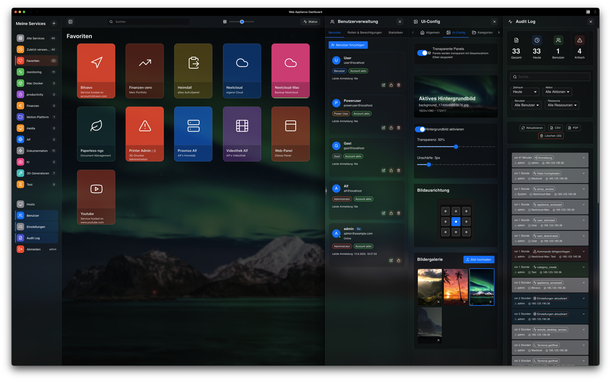
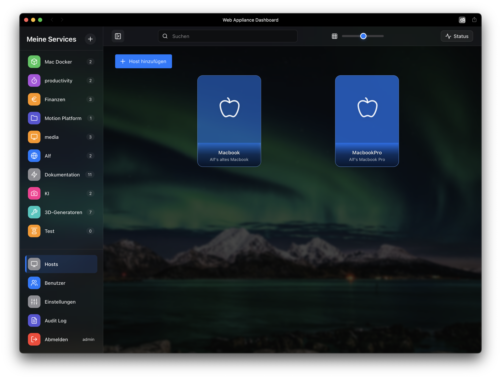
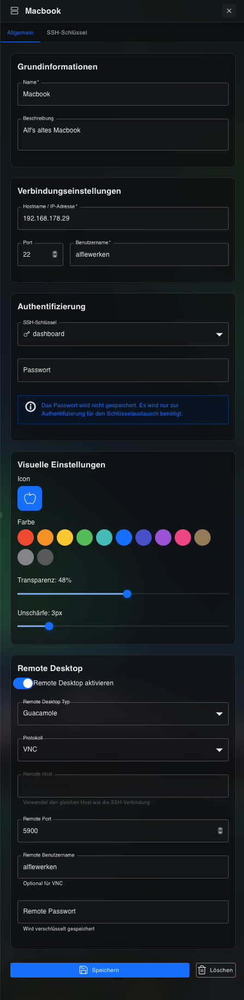
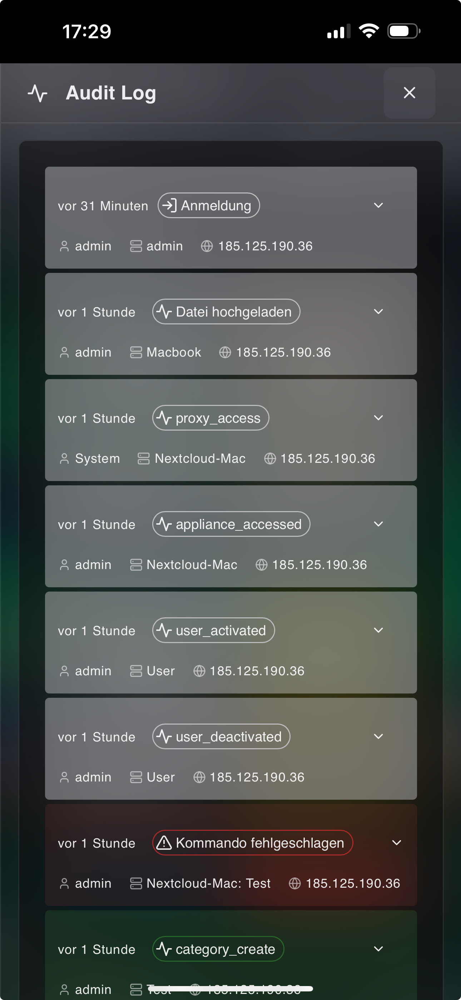

# Web Appliance Dashboard 🚀

[🇬🇧 English](README.md) | 🇩🇪 Deutsch | [📖 Benutzerhandbuch](docs/user-guide-v2/USER-GUIDE.md)

[](https://www.docker.com/)
[](https://nodejs.org/)
[](https://reactjs.org/)
[](LICENSE)
[](package.json)
[](SECURITY.md)

> **"Von einem Homelab-Enthusiasten für Homelab-Enthusiasten"**

Ein elegantes, selbst-gehostetes Dashboard für die zentrale Verwaltung von VMs, Docker-Containern und Services. Keine Cloud-Abhängigkeiten, keine Abos - nur ein solides Tool für Ihr Homelab.



## 🌟 Features

### Core Features
- **📊 Zentrales Dashboard** - Übersichtliche Verwaltung aller Services und Hosts
- **🔐 Authentifizierung** - JWT-basierte Benutzerverwaltung mit Rollen (Admin/User)
- **🖥️ Web Terminal** - Integriertes Terminal über ttyd mit SSH-Key Support
- **🔑 SSH Integration** - Vollständiges SSH-Key Management mit automatischer Authentifizierung
- **🖥️ Remote Desktop** - VNC & RDP Support über Apache Guacamole
- **📦 Service Control** - Start/Stop/Status von Services über SSH
- **🎨 Clean UI Philosophy** - "Hover-to-Reveal" (Desktop), "Touch-to-Show" (Mobile)
- **📱 Mobile First** - PWA-fähig, optimiert für iPhone und Tablets

### Enterprise Features
- **💾 Backup & Restore** - Komplette Systemsicherung mit Verschlüsselung
- **📝 Audit Logging** - Compliance-fähig mit Undo-Funktion
- **⚡ Echtzeit-Updates** - Server-Sent Events (SSE) für Live-Status
- **🛡️ Sicherheit** - Rate Limiting, CORS, Helmet.js, CSP
- **🌐 Multi-User** - Benutzerverwaltung mit granularem Rechtesystem (in Entwicklung)
- **🔍 Volltextsuche** - Schnelle Suche über alle Services
- **💡 Smart Categories** - Automatische Gruppierung mit Service-Counter

## 🆕 Neueste Updates (v1.1.2)

### 📖 Neues Benutzerhandbuch
- ✅ Umfassende Dokumentation mit 600+ Zeilen
- ✅ Persönliche Entstehungsgeschichte des Projekts
- ✅ Mobile-First Dokumentation mit iPhone Screenshots
- ✅ Praktische Workflows statt Feature-Listen
- ✅ Clean UI Philosophy dokumentiert

### Host-First Konzept
- ✅ Hosts als Grundlage für alle Services
- ✅ Verbesserte Host-Verwaltung
- ✅ Detaillierte Host-Konfiguration
- ✅ SSH-Key Management pro Host

### UI/UX Verbesserungen
- ✅ Interaktive Tooltips für kollabierte Sidebar
- ✅ Toggle-Funktionalität für Sidepanels
- ✅ Verbesserte Resize-Funktionalität für Panels
- ✅ Kein horizontales Scrolling in der Sidebar

### Neue Features
- ✅ Verschlüsselungsschlüssel-Dialog nach Backup
- ✅ Guacamole Cache-Clear API Endpoint
- ✅ Verbesserte SSH-Host Update-Funktionalität
- ✅ Terminal Error Suppressor für saubere Konsole

### Bug Fixes
- ✅ Health Check Probleme behoben (ttyd, webserver)
- ✅ SSH File Upload bei 10% hängen behoben
- ✅ Hostname-Duplikat Check beim Update korrigiert
- ✅ Remote Desktop nach Logout funktioniert wieder

## 📸 Screenshots

<details>
<summary><b>Alle Screenshots anzeigen</b></summary>

### Dashboard Übersicht

*Desktop Dashboard mit Clean UI*

### Host-Verwaltung

*Host-Übersicht mit allen angelegten Rechnern*


*Host-Karte mit Hover-to-Reveal Buttons*


*Detaillierte Host-Konfiguration*

### Mobile Experience

*iPhone Dashboard Ansicht*


*SSH Terminal auf dem iPhone*


*Audit Log mobil - Compliance-fähig*


*Kategorien mit Service-Counter*

</details>

## 📋 Voraussetzungen

- Docker & Docker Compose (v2.0+)
- Linux/macOS/Windows mit WSL2
- 2GB RAM (4GB empfohlen)
- 10GB freier Speicherplatz

## 🚀 Quick Start

### Das wichtigste Konzept: Hosts zuerst!
Services laufen auf Rechnern (Hosts). Ohne Host kein Service! Das Dashboard folgt diesem logischen Aufbau.

### 1. Repository klonen
```bash
git clone https://github.com/alflewerken/web-appliance-dashboard.git
cd web-appliance-dashboard
```

### 2. Environment Setup
```bash
./scripts/setup-env.sh
```
⚠️ **Wichtig**: Das Script generiert automatisch sichere Passwörter und ersetzt die unsicheren Beispielwerte!

### 3. Frontend bauen und Container starten
```bash
./scripts/build.sh
```

### 4. Dashboard öffnen
```
http://localhost:9080
```

Standard-Login:
- **Benutzer**: admin
- **Passwort**: admin123

⚠️ **Wichtig**: Ändern Sie das Standard-Passwort sofort!

### 5. Ersten Host anlegen
1. Klicken Sie auf "Hosts" in der Sidebar
2. "Host hinzufügen" anklicken
3. Host-Daten eingeben (IP, SSH-Zugangsdaten)
4. Speichern - fertig!

Ausführliche Anleitung: [📖 Benutzerhandbuch](docs/user-guide-v2/USER-GUIDE.md)

## 📚 Dokumentation

### 📖 Für Anwender
- **[Benutzerhandbuch](docs/user-guide-v2/USER-GUIDE.md)** - Umfassende Anleitung mit persönlicher Note
  - Entstehungsgeschichte & Motivation
  - Schnellstart in 5 Minuten (Host-First!)
  - Mobile Experience Guide
  - Praktische Workflows
  - Clean UI Philosophy

### Entwickler-Dokumentation
- [Entwicklerleitfaden](docs/developer.html) - Architektur mit Diagrammen
- [API-Referenz](docs/api-reference-ger.md) - API-Dokumentation
- [API Client SDKs](docs/api-client-sdks-ger.md) - Client-Beispiele
- [Integrationsleitfaden](docs/integration-guide-ger.md) - Integration in bestehende Systeme
- [Entwicklungsumgebung](docs/DEVELOPMENT_SETUP-ger.md) - Entwicklungsumgebung einrichten

### Setup & Konfiguration
- [Remote-Desktop-Einrichtung](docs/remote-desktop-setup-guide-ger.md) - Guacamole einrichten
- [Sicherheitsleitfaden](docs/security-best-practices-guide-ger.md) - Sicherheitsrichtlinien
- [Leistungsoptimierung](docs/performance-tuning-guide-ger.md) - Optimierung
- [Docker-Umgebung](docs/docker-env-setup-ger.md) - Docker Konfiguration

### Technische Dokumentation
- [Backend-Proxy-Implementierung](docs/BACKEND_PROXY_IMPLEMENTATION-ger.md) - Proxy-Architektur
- [OpenAPI-Spezifikation](docs/openapi.yaml) - API Spezifikation

## 🔒 Sicherheit

### Integrierte Sicherheitsfunktionen
- **JWT-Authentifizierung** - Sichere Token-basierte Authentifizierung
- **Verschlüsselte Passwörter** - AES-256 für Remote-Host-Passwörter
- **Rate-Limiting** - Schutz vor Brute-Force-Angriffen
- **CORS-Schutz** - Konfigurierbare Richtlinien
- **SQL-Injection-Schutz** - Prepared Statements
- **XSS-Prävention** - Eingabebereinigung

### Wichtige Sicherheitshinweise

⚠️ **Verschlüsselungsschlüssel**: 
- Wird beim Setup generiert oder manuell eingegeben
- Sicher aufbewahren (z.B. Passwort-Manager)
- Benötigt für Passwort-Entschlüsselung nach Restore

⚠️ **Best Practices**:
- Alle Standard-Passwörter ändern
- HTTPS mit gültigem Zertifikat verwenden
- Regelmäßige Backups erstellen
- Firewall-Regeln konfigurieren

## 🏗️ Architektur

```
┌─────────────────┐     ┌─────────────────┐     ┌─────────────────┐
│ React Frontend  │────▶│  Nginx Proxy    │────▶│  Node.js API    │
│                 │     │   (Port 9080)   │     │   (Port 3001)   │
└─────────────────┘     └─────────────────┘     └─────────────────┘
                                                          │
                        ┌─────────────────┐               │
                        │   Web Terminal  │◀──────────────┤
                        │     (ttyd)      │               │
                        └─────────────────┘               │
                                                          │
                        ┌─────────────────┐               │
                        │    Guacamole    │◀──────────────┤
                        │   (VNC/RDP)     │               │
                        └─────────────────┘               │
                                                          │
                        ┌─────────────────┐               │
                        │    MySQL DB     │◀──────────────┘
                        │   (Port 3306)   │
                        └─────────────────┘
```

## 🛠️ Konfiguration

### Environment Variablen

Die wichtigsten Einstellungen in der `.env` Datei:

```env
# Ports
PUBLIC_PORT=9080
BACKEND_PORT=3000
FRONTEND_PORT=3001

# Security
JWT_SECRET=<auto-generated>
SSH_KEY_ENCRYPTION_SECRET=<your-encryption-key>

# Database
MYSQL_ROOT_PASSWORD=<auto-generated>
MYSQL_PASSWORD=<auto-generated>

# Features
ENABLE_REMOTE_DESKTOP=true
ENABLE_AUDIT_LOG=true
```

### Docker Compose Override

Für spezifische Anpassungen erstellen Sie eine `docker-compose.override.yml`:

```yaml
version: '3.8'
services:
  webserver:
    ports:
      - "443:443"
    volumes:
      - ./ssl:/etc/nginx/ssl:ro
```

## 🔧 Wartung

### Backup erstellen
```bash
# Über die UI: Einstellungen → Backup → Backup erstellen
# Oder via Script:
docker exec appliance_backend npm run backup
```

### Logs anzeigen
```bash
# Alle Services
docker compose logs -f

# Spezifischer Service
docker compose logs -f backend
```

### Container neu starten
```bash
# Alle Services
docker compose restart

# Einzelner Service
docker compose restart backend
```

### Updates
```bash
git pull
docker compose down
docker compose build
docker compose up -d
```

## 📊 Leistung

### System-Anforderungen
- **CPU**: 2 Cores (4 empfohlen)
- **RAM**: 2GB minimum (4GB empfohlen)
- **Festplatte**: 10GB (20GB empfohlen)

### Optimierungen
- Redis-Cache (optional)
- CDN für statische Ressourcen
- Datenbankabfrage-Optimierung
- Verbindungspooling

## 🐛 Fehlerbehebung

### Häufige Probleme

**Container startet nicht:**
```bash
docker compose down -v
docker compose up -d
```

**Passwort vergessen:**
```bash
docker exec appliance_backend npm run reset-admin-password
```

**SSL-Zertifikat-Fehler:**
- Prüfen Sie die Nginx-Konfiguration
- Stellen Sie sicher, dass Port 443 verfügbar ist

### Debug-Modus

Für detaillierte Logs:
```bash
# .env anpassen
NODE_ENV=development
LOG_LEVEL=debug

# Container neu starten
docker compose restart backend
```

## 🤝 Contributing

Wir freuen uns über Beiträge! Siehe [CONTRIBUTING.md](CONTRIBUTING.md) für Details.

### Development Setup
```bash
# Frontend Development
cd frontend
npm install
npm run dev

# Backend Development
cd backend
npm install
npm run dev
```

## 📄 Lizenz

Dieses Projekt ist unter der MIT License lizenziert - siehe [LICENSE](LICENSE) für Details.

## 🙏 Danksagungen

- [React](https://reactjs.org/) - UI Framework
- [Express.js](https://expressjs.com/) - Backend Framework
- [Apache Guacamole](https://guacamole.apache.org/) - Remote Desktop
- [ttyd](https://github.com/tsl0922/ttyd) - Web Terminal
- Alle weiteren [Open Source Projekte](package.json) die dieses Projekt ermöglichen

## 💬 Über das Projekt

> "Nach 30 Jahren in der IT und unzähligen Tools später wollte ich einfach ein Dashboard, das funktioniert. Kein Schnickschnack, keine Cloud-Abhängigkeit, keine monatlichen Gebühren. Nur ein solides, schönes Tool für mein Homelab. Wenn es Ihnen hilft, Ihr Homelab besser zu managen - Mission erfüllt!"
>
> *- Alf, 56, IT-Enthusiast seit dem Sinclair ZX80*

---

<p align="center">
  Made with ❤️ by <a href="https://github.com/alflewerken">Alf Lewerken</a><br>
  <i>Von einem Homelab-Enthusiasten für Homelab-Enthusiasten</i>
</p>