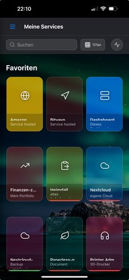
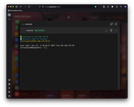
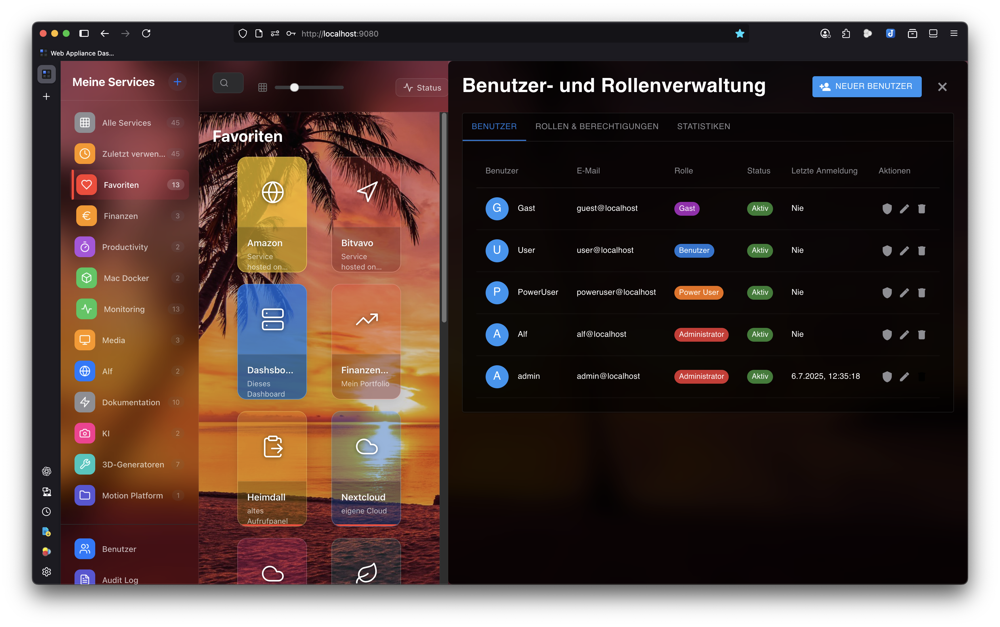

# Web Appliance Dashboard 🚀

🇬🇧 English | [🇩🇪 Deutsch](README.md)

[](https://www.docker.com/)
[](https://nodejs.org/)
[](https://reactjs.org/)
[](LICENSE)
[](package.json)
[](SECURITY.md)

A modern, containerized dashboard for centralized management and monitoring of web appliances, services, and servers with integrated SSH functionality, web terminal, and remote desktop support.


## 🌟 Features

### Core Features
- **📊 Central Dashboard** - Clear management of all appliances with categorization
- **🔐 Authentication** - JWT-based user management with roles (Admin/User)
- **🖥️ Web Terminal** - Integrated terminal via ttyd with SSH key support
- **🔑 SSH Integration** - Complete SSH key management with automatic authentication
- **🖥️ Remote Desktop** - VNC & RDP support via Apache Guacamole
- **📦 Service Control** - Start/Stop/Status of services via SSH
- **🎨 Customizable Design** - Dark/Light mode, custom backgrounds, glassmorphism
- **📱 Responsive** - Optimized for desktop, tablet, and mobile (PWA-ready)

### Advanced Features
- **💾 Backup & Restore** - Complete system backup with encryption and key dialog
- **📝 Audit Logging** - Traceable action logs with export
- **⚡ Real-time Updates** - Server-Sent Events (SSE) for live status
- **🛡️ Security** - Rate limiting, CORS, Helmet.js, CSP, no debug endpoints
- **🌐 Multi-User** - User management with granular permission system
- **🔍 Full-text Search** - Fast search across all appliances
- **💡 Smart UI** - Tooltips, toggle panels, resizable sidebars

## 🆕 Latest Updates (v1.1.1)

### Security Improvements
- ✅ All debug files and directories removed
- ✅ No more publicly accessible debug endpoints
- ✅ Clean browser console without debug output
- ✅ Reduced attack surface for production

### UI/UX Improvements
- ✅ Interactive tooltips for collapsed sidebar
- ✅ Toggle functionality for side panels
- ✅ Improved resize functionality for panels
- ✅ No horizontal scrolling in sidebar

### New Features
- ✅ Encryption key dialog after backup
- ✅ Guacamole cache-clear API endpoint
- ✅ Improved SSH host update functionality
- ✅ Terminal error suppressor for clean console

### Bug Fixes
- ✅ Health check issues fixed (ttyd, webserver)
- ✅ SSH file upload hanging at 10% fixed
- ✅ Hostname duplicate check on update corrected
- ✅ Remote desktop after logout works again

## 📸 Screenshots

<details>
<summary><b>View all screenshots</b></summary>

### Dashboard & Navigation

*Desktop Dashboard Overview*


*Mobile View*


*Tablet/iPad View*

### Service Management
.png)
*Service Card - Service Running (Green)*

.png)
*Service Card - Service Stopped (Red)*


*Create New Service*

### Terminal & Remote Access

*Integrated Web Terminal*


*Custom SSH Commands*

### Administration

*User Management*


*Audit Log Overview*

### Settings

*Manage Categories*


*Customize Background*


*Backup & Restore*

</details>

## 📋 Prerequisites

- Docker & Docker Compose (v2.0+)
- Linux/macOS/Windows with WSL2
- 2GB RAM (4GB recommended)
- 10GB free disk space

## 🚀 Quick Start

### 1. Clone Repository
```bash
git clone https://github.com/alflewerken/web-appliance-dashboard.git
cd web-appliance-dashboard
```

### 2. Environment Setup
```bash
./scripts/setup-env.sh
```
The script will:
- Create secure passwords
- Configure the .env file
- Ask for encryption key
- Prepare the Docker environment

### 3. Start Containers
```bash
docker compose up -d
```

### 4. Open Dashboard
```
http://localhost:9080
```

Default login:
- **Username**: admin
- **Password**: changeme123

⚠️ **Important**: Change the default password immediately after first login!

## 📚 Documentation

### User Documentation
- [User Manual](docs/user-manual/index.html) - Web-based guide

### Developer Documentation
- [Developer Guide](docs/developer.html) - Architecture with diagrams
- [API Reference](docs/api-reference.md) - API documentation
- [API Client SDKs](docs/api-client-sdks.md) - Client examples
- [Integration Guide](docs/integration-guide.md) - Integration with existing systems
- [Development Setup](docs/DEVELOPMENT_SETUP.md) - Setting up development environment

### Setup & Configuration
- [Remote Desktop Setup](docs/remote-desktop-setup-guide.md) - Configure Guacamole
- [Security Guide](docs/security-best-practices-guide.md) - Security guidelines
- [Performance Tuning](docs/performance-tuning-guide.md) - Optimization
- [Docker Environment](docs/docker-env-setup.md) - Docker configuration

### Technical Documentation
- [Backend Proxy Implementation](docs/BACKEND_PROXY_IMPLEMENTATION.md) - Proxy architecture
- [OpenAPI Specification](docs/openapi.yaml) - API specification

## 🔒 Security

### Built-in Security Features
- **JWT Authentication** - Secure token-based authentication
- **Encrypted Passwords** - AES-256 for remote host passwords
- **Rate Limiting** - Brute-force protection
- **CORS Protection** - Configurable policies
- **SQL Injection Protection** - Prepared statements
- **XSS Prevention** - Input sanitization

### Important Security Notes

⚠️ **Encryption Key**: 
- Generated during setup or manually entered
- Store securely (e.g., password manager)
- Required for password decryption after restore

⚠️ **Best Practices**:
- Change all default passwords
- Use HTTPS with valid certificate
- Create regular backups
- Configure firewall rules

## 🏗️ Architecture

```
┌─────────────────┐     ┌─────────────────┐     ┌─────────────────┐
│   React SPA     │────▶│  Nginx Proxy    │────▶│  Node.js API    │
│   (Port 3001)   │     │   (Port 80)     │     │   (Port 3000)   │
└─────────────────┘     └─────────────────┘     └─────────────────┘
                                                          │
                        ┌─────────────────┐               │
                        │   Web Terminal  │◀──────────────┤
                        │     (ttyd)      │               │
                        └─────────────────┘               │
                                                          │
                        ┌─────────────────┐               │
                        │    Guacamole    │◀──────────────┤
                        │   (VNC/RDP)     │               │
                        └─────────────────┘               │
                                                          │
                        ┌─────────────────┐               │
                        │    MySQL DB     │◀──────────────┘
                        │   (Port 3306)   │
                        └─────────────────┘
```

## 🛠️ Configuration

### Environment Variables

Key settings in the `.env` file:

```env
# Ports
PUBLIC_PORT=9080
BACKEND_PORT=3000
FRONTEND_PORT=3001

# Security
JWT_SECRET=<auto-generated>
SSH_KEY_ENCRYPTION_SECRET=<your-encryption-key>

# Database
MYSQL_ROOT_PASSWORD=<auto-generated>
MYSQL_PASSWORD=<auto-generated>

# Features
ENABLE_REMOTE_DESKTOP=true
ENABLE_AUDIT_LOG=true
```

### Docker Compose Override

For specific customizations, create a `docker-compose.override.yml`:

```yaml
version: '3.8'
services:
  webserver:
    ports:
      - "443:443"
    volumes:
      - ./ssl:/etc/nginx/ssl:ro
```

## 🔧 Maintenance

### Create Backup
```bash
# Via UI: Settings → Backup → Create Backup
# Or via script:
docker exec appliance_backend npm run backup
```

### View Logs
```bash
# All services
docker compose logs -f

# Specific service
docker compose logs -f backend
```

### Restart Containers
```bash
# All services
docker compose restart

# Single service
docker compose restart backend
```

### Updates
```bash
git pull
docker compose down
docker compose build
docker compose up -d
```

## 📊 Performance

### System Requirements
- **CPU**: 2 Cores (4 recommended)
- **RAM**: 2GB minimum (4GB recommended)
- **Disk**: 10GB (20GB recommended)

### Optimizations
- Redis Cache (optional)
- CDN for Static Assets
- Database Query Optimization
- Connection Pooling

## 🐛 Troubleshooting

### Common Issues

**Container won't start:**
```bash
docker compose down -v
docker compose up -d
```

**Forgot password:**
```bash
docker exec appliance_backend npm run reset-admin-password
```

**SSL certificate error:**
- Check Nginx configuration
- Ensure port 443 is available

### Debug Mode

For detailed logs:
```bash
# Edit .env
NODE_ENV=development
LOG_LEVEL=debug

# Restart containers
docker compose restart backend
```

## 🤝 Contributing

We welcome contributions! See [CONTRIBUTING.md](CONTRIBUTING.md) for details.

### Development Setup
```bash
# Frontend Development
cd frontend
npm install
npm run dev

# Backend Development
cd backend
npm install
npm run dev
```

## 📄 License

This project is licensed under the MIT License - see [LICENSE](LICENSE) for details.

## 🙏 Acknowledgments

- [React](https://reactjs.org/) - UI Framework
- [Express.js](https://expressjs.com/) - Backend Framework
- [Apache Guacamole](https://guacamole.apache.org/) - Remote Desktop
- [ttyd](https://github.com/tsl0922/ttyd) - Web Terminal
- All other [Open Source Projects](package.json) that make this project possible

---

<p align="center">
  Made with ❤️ by <a href="https://github.com/alflewerken">Alf Lewerken</a>
</p>