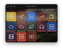

# Web Appliance Dashboard 🚀

🇬🇧 English | [🇩🇪 Deutsch](README.md)

[](https://www.docker.com/)
[](https://nodejs.org/)
[](https://reactjs.org/)
[](LICENSE)

A modern, containerized dashboard for central management and monitoring of web appliances, services, and servers with integrated SSH functionality and web terminal.


## 🌟 Features

### Core Features
- **📊 Central Dashboard** - Clear management of all appliances
- **🔐 Authentication** - JWT-based user management with roles
- **🖥️ Web Terminal** - Integrated terminal via ttyd
- **🔑 SSH Integration** - Complete SSH key management
- **🖥️ Remote Desktop** - VNC & RDP support via Guacamole
- **📦 Service Control** - Start/Stop/Status of services
- **🎨 Customizable Design** - Dark/Light mode, custom backgrounds
- **📱 Responsive** - Optimized for desktop, tablet, and mobile
- **🍎 macOS App** - Native Electron app for macOS

### Advanced Features
- **💾 Backup & Restore** - Complete system backup
- **📝 Audit Logging** - Traceable action logs
- **⚡ Real-time Updates** - Server-Sent Events (SSE)
- **🔄 Auto-Discovery** - Automatic service detection
- **🛡️ Security** - Rate limiting, CORS, Helmet.js
- **🌐 Multi-User** - User management with permission system

## 📸 Screenshots

### Login Screen


### Dashboard Overview


### Mobile View
<p align="center">
  
  
</p>

### Service Cards
.png)
*Service Card with green status - Service running*

.png)
*Service Card with red status - Service stopped*

### Terminal Integration

*Integrated web terminal for SSH access*

### Widget View

*Compact widget view for quick access*

### Management

*User management with role assignment*


*Complete audit log of all actions*

## 📋 Prerequisites

- Docker & Docker Compose (v2.0+)
- Node.js 18+ (for local development)
- macOS, Linux, or Windows with WSL2
- 2GB RAM minimum
- 10GB free disk space

## 🚀 Quick Start

### 1. Clone Repository

#### With SSH (Recommended):
```bash
git clone git@github.com:alflewerken/web-appliance-dashboard.git
cd web-appliance-dashboard
```

#### With Personal Access Token:
```bash
# Replace YOUR_TOKEN with your GitHub Personal Access Token
git clone https://YOUR_TOKEN@github.com/alflewerken/web-appliance-dashboard.git
cd web-appliance-dashboard
```

> **Note**: This repository is private. You need access rights and must authenticate.

## 🚀 Installation

### Option 1: Quick Start (Recommended)

#### 1. Set up environment variables
```bash
# Automatic configuration
./scripts/setup-env.sh
```

#### 2. Start installation
```bash
# Complete installation with all features
./scripts/build.sh --nocache
```

This command:
- Clears all Docker caches for a clean installation
- Rebuilds all containers
- Installs all services including Remote Desktop
- Starts the complete system

### Option 2: Manual Installation

#### 1. Configure Environment Variables

##### Automatic Setup (recommended)
```bash
# Guides you through configuration and generates secure secrets
./scripts/setup-env.sh
```

##### Manual Setup
```bash
# Create environment file
cp .env.example .env

# Backend environment
cp backend/.env.example backend/.env

# Frontend environment  
cp frontend/.env.example frontend/.env

# IMPORTANT: Adjust all passwords and secret keys in .env!
```

See [Docker Environment Setup Guide](docs/docker-env-setup.md) for details.

#### 2. Start Docker Containers

##### Build Options:
```bash
# Standard installation (with Remote Desktop)
./scripts/build.sh

# Installation without Remote Desktop (smaller footprint)
./scripts/build.sh --no-remote-desktop

# Rebuild with cache clearing (for problems)
./scripts/build.sh --nocache

# Quick restart (for development)
./scripts/build.sh --refresh
```

### After Installation

#### Access Dashboard
- **Web Interface**: http://localhost:9080
- **API**: http://localhost:3001
- **Web Terminal**: http://localhost:7681/terminal
- **Guacamole** (Remote Desktop): http://localhost:8080/guacamole

#### Default Login
- **Username**: admin
- **Password**: admin123 (please change immediately!)


*Add new service - simple and intuitive*

## 🛠️ Management & Maintenance

### Build Commands
```bash
# Standard installation (with Remote Desktop)
./scripts/build.sh

# Installation without Remote Desktop (smaller footprint)
./scripts/build.sh --no-remote-desktop

# Rebuild with cache clearing (for Docker problems)
./scripts/build.sh --nocache

# Quick restart for code changes (development)
./scripts/build.sh --refresh

# Also build macOS app
./scripts/build.sh --macos-app
```

### Container Management
```bash
# Start containers
docker compose up -d

# Stop containers
docker compose down

# Check container status
./status.sh

# Show logs
docker compose logs -f

# Backend logs only
docker compose logs -f backend
```

### Maintenance & Updates
```bash
# Update to Remote Desktop afterwards
./scripts/update-remote-desktop.sh

# Complete rebuild (DELETES ALL DATA!)
./scripts/clean-build.sh

# Delete containers and rebuild
./scripts/clean.sh && ./scripts/build.sh
```

### Remote Desktop Services
```bash
# Start Remote Desktop only
docker compose up -d guacamole-postgres guacd guacamole

# Stop Remote Desktop only
docker compose stop guacamole-postgres guacd guacamole
```

## 🏗️ Architecture

```
┌─────────────────┐     ┌─────────────────┐     ┌─────────────────┐
│                 │     │                 │     │                 │
│   React SPA     │────▶│  Nginx Proxy    │────▶│  Node.js API    │
│   (Frontend)    │     │   (Port 9080)   │     │   (Port 3001)   │
│                 │     │                 │     │                 │
└─────────────────┘     └─────────────────┘     └─────────────────┘
                                                          │
                        ┌─────────────────┐               │
                        │                 │               │
                        │   Web Terminal  │◀──────────────┤
                        │     (ttyd)      │               │
                        │                 │               │
                        └─────────────────┘               │
                                                          │
                        ┌─────────────────┐               │
                        │                 │               │
                        │    Guacamole    │◀──────────────┤
                        │   (VNC/RDP)     │               │
                        │                 │               │
                        └─────────────────┘               │
                                                          │
                        ┌─────────────────┐               │
                        │                 │               │
                        │    MariaDB      │◀──────────────┘
                        │   (Database)    │
                        │                 │
                        └─────────────────┘
```

## 🎨 User Interface

The dashboard offers a modern, intuitive user interface with various views:

### Desktop & Tablet

*Responsive design for all screen sizes*

### Service Management

*Custom commands for quick actions*

### Settings
<p align="center">
  
  
</p>

### SSH & Backup
<p align="center">
  
  
</p>

## 📁 Project Structure

```
web-appliance-dashboard/
├── backend/                 # Node.js Express API
│   ├── routes/             # API Endpoints
│   ├── utils/              # Helper Functions
│   ├── uploads/            # File Uploads
│   └── server.js           # Main Server File
├── frontend/               # React SPA
│   ├── src/
│   │   ├── components/     # React Components
│   │   ├── contexts/       # React Contexts
│   │   ├── hooks/          # Custom Hooks
│   │   ├── services/       # API Services
│   │   └── utils/          # Utilities
│   └── build/              # Production Build
├── nginx/                  # Nginx Configuration
├── macos-app/             # Electron macOS App
├── scripts/               # Management Scripts
├── docs/                  # Documentation
├── docker-compose.yml     # Docker Orchestration
└── init.sql              # Database Schema
```

## 🛠️ Development

### Backend Development
```bash
cd backend
npm install
npm run dev
```

### Frontend Development
```bash
cd frontend
npm install
npm start
```

### macOS App Development
```bash
cd macos-app
npm install
npm run dev
```

## 🔧 Configuration

### Important Environment Variables

#### Backend (.env)
```env
# Database
DB_HOST=database
DB_PORT=3306
DB_USER=dashboard_user
DB_PASSWORD=dashboard_pass123
DB_NAME=appliance_dashboard

# Security
JWT_SECRET=your-secret-key
SSH_KEY_ENCRYPTION_SECRET=your-encryption-key

# Server
PORT=3001
NODE_ENV=production
```

#### Docker Compose Override
For local development, create a `docker-compose.override.yml`:
```yaml
version: '3.8'
services:
  backend:
    volumes:
      - ./backend:/app
    environment:
      NODE_ENV: development
```

## 🔒 Security

### Best Practices
- ✅ JWT Token Authentication
- ✅ Password hashing with bcrypt
- ✅ Rate limiting for API
- ✅ CORS Protection
- ✅ SQL Injection Protection
- ✅ XSS Protection via Helmet.js
- ✅ SSH Key Encryption

### Recommendations
1. Change all default passwords
2. Use strong JWT secrets
3. Enable HTTPS in production
4. Regular security updates
5. Implement backup strategy

## 📚 API Documentation

Complete API documentation is available:

- **[API Reference](docs/api-reference.md)** - Detailed endpoint documentation
- **[OpenAPI/Swagger](docs/openapi.yaml)** - OpenAPI 3.0 specification
- **[Client Examples](docs/api-reference.md#api-client-beispiele)** - Examples in JavaScript, Python, cURL, PHP, and Go

### Authentication
```bash
# Login
POST /api/auth/login
Content-Type: application/json
{
  "username": "admin",
  "password": "password"
}

# Response
{
  "token": "eyJhbGciOiJIUzI1NiIs...",
  "user": {
    "id": 1,
    "username": "admin",
    "role": "admin"
  }
}
```

### Appliances
```bash
# Get all appliances
GET /api/appliances
Authorization: Bearer <token>

# Create appliance
POST /api/appliances
Authorization: Bearer <token>
Content-Type: application/json
{
  "name": "My Server",
  "url": "https://server.local",
  "icon": "Server",
  "category": "infrastructure"
}

# Update appliance
PUT /api/appliances/:id
Authorization: Bearer <token>

# Delete appliance
DELETE /api/appliances/:id
Authorization: Bearer <token>
```

### SSH Management
```bash
# Get SSH keys
GET /api/ssh/keys
Authorization: Bearer <token>

# Generate new SSH key
POST /api/ssh/keys/generate
Authorization: Bearer <token>
{
  "name": "production-key",
  "type": "rsa",
  "bits": 4096
}

# Test SSH connection
POST /api/ssh/test
Authorization: Bearer <token>
{
  "host": "192.168.1.100",
  "username": "root",
  "keyId": 1
}
```

## 🚢 Deployment

### Production with Docker
```bash
# Build and start
docker-compose -f docker-compose.yml up -d --build

# View logs
docker-compose logs -f

# Check status
./status.sh
```

### Kubernetes (coming soon)
```bash
kubectl apply -f k8s/
```

### Backup & Restore
```bash
# Create backup
curl -X POST http://localhost:3001/api/backup/create \
  -H "Authorization: Bearer <token>"

# Restore backup
curl -X POST http://localhost:3001/api/restore \
  -H "Authorization: Bearer <token>" \
  -F "backup=@backup-file.zip"
```

## 🧪 Testing

### Backend Tests
```bash
cd backend
npm test
npm run test:watch
```

### Frontend Tests
```bash
cd frontend
npm test
```

### E2E Tests (planned)
```bash
npm run test:e2e
```

## 📖 Additional Documentation

- **[API Reference](docs/api-reference.md)** - Complete API documentation with examples
- **[OpenAPI Specification](docs/openapi.yaml)** - OpenAPI 3.0 specification
- [Developer Documentation](docs/developer.html)
- [User Manual](docs/user-manual/)
- [API Reference](docs/api-reference.md)
- [Changelog](CHANGELOG.md)

## 🤝 Contributing

Contributions are welcome! Please note:

1. Fork the repository
2. Create a feature branch (`git checkout -b feature/AmazingFeature`)
3. Commit your changes (`git commit -m 'Add some AmazingFeature'`)
4. Push to the branch (`git push origin feature/AmazingFeature`)
5. Open a Pull Request

### Code Style
- ESLint for JavaScript
- Prettier for formatting
- Conventional Commits for Git messages

## 🐛 Known Issues

- [ ] SSH key rotation not yet implemented
- [ ] Multi-factor authentication (MFA) missing
- [ ] No support for LDAP/AD integration
- [ ] Performance with >1000 appliances not tested

## 🗺️ Roadmap

### Version 1.1 (Q3 2025)
- [ ] TypeScript Migration
- [ ] API Documentation (Swagger)
- [ ] Enhanced Test Coverage (>80%)
- [ ] GitHub Actions CI/CD

### Version 1.2 (Q4 2025)
- [ ] Multi-Factor Authentication
- [ ] LDAP/Active Directory Integration
- [ ] Prometheus/Grafana Monitoring
- [ ] Internationalization (i18n)

### Version 2.0 (Q1 2026)
- [ ] Kubernetes Support
- [ ] Plugin System
- [ ] GraphQL API
- [ ] Advanced RBAC

## 📊 Performance

- **Startup Time**: <5 seconds
- **API Response**: <100ms (avg)
- **Memory Usage**: ~200MB (idle)
- **Concurrent Users**: 100+ tested

## 🛟 Support

- **Issues**: [GitHub Issues](https://github.com/alflewerken/web-appliance-dashboard/issues)
- **Discussions**: [GitHub Discussions](https://github.com/alflewerken/web-appliance-dashboard/discussions)
- **Email**: support@example.com

## 📄 License

This project is licensed under the MIT License - see [LICENSE](LICENSE) for details.

## 🙏 Acknowledgements

- [React](https://reactjs.org/) - UI Framework
- [Express.js](https://expressjs.com/) - Backend Framework
- [Docker](https://www.docker.com/) - Containerization
- [Apache Guacamole](https://guacamole.apache.org/) - Clientless Remote Desktop Gateway
- [xterm.js](https://xtermjs.org/) - Terminal Emulator
- [ttyd](https://github.com/tsl0922/ttyd) - Share terminal over the web
- [MariaDB](https://mariadb.org/) - Database
- [Nginx](https://nginx.org/) - Web Server
- [Lucide](https://lucide.dev/) - Beautiful Icons

---

<p align="center">
  Made with ❤️ by <a href="https://github.com/alflewerken">Alf Lewerken</a>
</p>

<p align="center">
  <a href="#web-appliance-dashboard-">Back to top</a>
</p>
