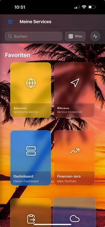

# Web Appliance Dashboard 🚀

🇬🇧 English | [🇩🇪 Deutsch](README.md)

[](https://www.docker.com/)
[](https://nodejs.org/)
[](https://reactjs.org/)
[](LICENSE)
[](package.json)
[](SECURITY.md)

A modern, containerized dashboard for centralized management and monitoring of web appliances, services, and servers with integrated SSH functionality, web terminal, and remote desktop support.


## 🌟 Features

### Core Features
- **📊 Central Dashboard** - Clear management of all appliances with categorization
- **🔐 Authentication** - JWT-based user management with roles (Admin/User)
- **🖥️ Web Terminal** - Integrated terminal via ttyd with SSH key support
- **🔑 SSH Integration** - Complete SSH key management with automatic authentication
- **🖥️ Remote Desktop** - VNC & RDP support via Apache Guacamole
- **📦 Service Control** - Start/Stop/Status of services via SSH
- **🎨 Customizable Design** - Dark/Light mode, custom backgrounds, glassmorphism
- **📱 Responsive** - Optimized for desktop, tablet, and mobile (PWA-ready)

### Advanced Features
- **💾 Backup & Restore** - Complete system backup with encryption and key dialog
- **📝 Audit Logging** - Traceable action logs with export
- **⚡ Real-time Updates** - Server-Sent Events (SSE) for live status
- **🛡️ Security** - Rate limiting, CORS, Helmet.js, CSP, no debug endpoints
- **🌐 Multi-User** - User management with granular permission system
- **📊 Performance Metrics** - CPU, Memory, Disk Usage Monitoring
- **🔍 Full-text Search** - Fast search across all appliances
- **💡 Smart UI** - Tooltips, toggle panels, resizable sidebars
## 🆕 Latest Updates (v1.1.1)

### Security Improvements
- ✅ All debug files and directories removed
- ✅ No more publicly accessible debug endpoints
- ✅ Clean browser console without debug output
- ✅ Reduced attack surface for production

### UI/UX Improvements
- ✅ Interactive tooltips for collapsed sidebar
- ✅ Toggle functionality for side panels
- ✅ Improved resize functionality for panels
- ✅ No horizontal scrolling in sidebar

### New Features
- ✅ Encryption key dialog after backup
- ✅ Guacamole cache-clear API endpoint
- ✅ Improved SSH host update functionality
- ✅ Terminal error suppressor for clean console

### Bug Fixes
- ✅ Health check issues fixed (ttyd, webserver)
- ✅ SSH file upload hanging at 10% fixed
- ✅ Hostname duplicate check on update corrected
- ✅ Remote desktop after logout works again

### Code Quality
- ✅ 109 console.log statements removed
- ✅ 31 debug files deleted
- ✅ 3 temporary backup directories removed
- ✅ Improved code organization

## 🆕 Previous Updates (v1.1.0)

### Remote Desktop Integration
- ✅ Apache Guacamole for VNC/RDP access
- ✅ Automatic token authentication
- ✅ Encrypted password storage
- ✅ Connection management via API

### SSH Terminal Improvements
- ✅ Automatic SSH key usage
- ✅ No password input required with configured keys
- ✅ Improved terminal output with colors
- ✅ SSH config integration

### UI/UX Improvements
- ✅ New glassmorphism design
- ✅ Improved mobile navigation
- ✅ Optimized service cards
- ✅ Dark/Light mode toggle

## 📸 Screenshots

### Login Screen


### Dashboard Overview


### Mobile View
<p align="center">
  
  
</p>
### Service Cards
.png)
*Service card with green status - Service running*

.png)
*Service card with red status - Service stopped*

### Terminal Integration

*Integrated web terminal with SSH key authentication*

### Remote Desktop
*VNC/RDP access via integrated Guacamole*

### Widget View

*Compact widget view for quick access*

### Administration

*User management with role assignment*


*Complete audit log of all actions*

## 📋 Prerequisites

- Docker & Docker Compose (v2.0+)
- Node.js 18+ (for local development)
- macOS (Apple Silicon/Intel), Linux or Windows with WSL2
- 2GB RAM minimum (4GB recommended)
- 10GB free disk space
## 🚀 Quick Start

### 1. Clone Repository

#### With SSH (Recommended):
```bash
git clone git@github.com:alflewerken/web-appliance-dashboard.git
cd web-appliance-dashboard
```

#### With Personal Access Token:
```bash
# Replace YOUR_TOKEN with your GitHub Personal Access Token
git clone https://YOUR_TOKEN@github.com/alflewerken/web-appliance-dashboard.git
cd web-appliance-dashboard
```

> **Note**: This repository is private. You need access rights and must authenticate.

### 2. Quick Installation

```bash
# Automatic configuration and installation
./scripts/build.sh --nocache
```
On first start, the script will ask for a domain name and an external host name. Enter the computer name or IP of the Docker host running the Web Appliance Dashboard for the domain name. If the Web Appliance Dashboard is running behind a reverse proxy like nginx, enter the external domain of the Docker host here, such as dashboard.example.com
The system will be accessible at http://localhost:9080 after a few minutes. The reverse proxy should be configured to map from the Docker host's internal IP with port 9080 to port 443 (https).

This command:
- Clears all Docker caches for a clean installation
- Rebuilds all containers (Backend, Frontend, Database, Guacamole, ttyd)
- Installs all services including remote desktop
- Starts the complete system
### Option 2: Manual Installation

#### 1. Configure Environment Variables

##### Automatic Setup (recommended)
```bash
# Guides you through configuration and generates secure secrets
./scripts/setup-env.sh
```
##### Manual Setup
```bash
# Create environment file
cp .env.example .env

# Backend Environment
cp backend/.env.example backend/.env

# Frontend Environment  
cp frontend/.env.example frontend/.env

# IMPORTANT: Adjust all passwords and secret keys in .env!
```

See [Docker Environment Setup Guide](docs/docker-env-setup.md) for details.

#### 2. Start Docker Containers

##### Build Options:
```bash
# Standard installation (with remote desktop)
./scripts/build.sh

# Installation without remote desktop (smaller footprint)
./scripts/build.sh --no-remote-desktop

# Rebuild with cache clearing (for problems)
./scripts/build.sh --nocache
# Quick restart (for development)
./scripts/build.sh --refresh
```
### After Installation

#### Access Dashboard
- **Web Interface**: http://localhost:9080
- **API**: http://localhost:9080/api
- **API Docs**: http://localhost:9080/api-docs
- **Web Terminal**: http://localhost:9080/terminal/
- **Guacamole** (Remote Desktop): http://localhost:9080/guacamole/

#### Default Login
- **User**: admin
- **Password**: admin123 (please change immediately!)

#### Guacamole Login (if accessed directly)
- **User**: guacadmin
- **Password**: guacadmin


*Add new service - simple and intuitive*

## 🛠️ Management & Maintenance

### Build Commands
```bash
# Standard installation (with remote desktop)
./scripts/build.sh

# Installation without remote desktop (smaller footprint)
./scripts/build.sh --no-remote-desktop

# Rebuild with cache clearing (for Docker problems)
./scripts/build.sh --nocache

# Quick restart for code changes (development)
./scripts/build.sh --refresh

# Build macOS app
./scripts/build.sh --macos-app
```
### Container Management
```bash
# Start containers
docker compose up -d

# Stop containers
docker compose down

# Check container status
./status.sh

# Show logs
docker compose logs -f
# Backend logs only
docker compose logs -f backend

# Guacamole logs only
docker compose logs -f guacamole
```

### Maintenance & Updates
```bash
# Update to remote desktop retroactively
./scripts/update-remote-desktop.sh

# Complete rebuild (DELETES ALL DATA!)
./scripts/clean.sh --all

# Delete containers and rebuild
./scripts/clean.sh && ./scripts/build.sh

# Run database migration
docker exec appliance_backend npm run migrate
```

### Remote Desktop Services
```bash
# Start remote desktop only
docker compose up -d guacamole-postgres guacd guacamole

# Stop remote desktop only
docker compose stop guacamole-postgres guacd guacamole

# Check Guacamole connections
docker exec appliance_backend node utils/guacamole/test-connection.js
```
## 🛡️ Security

### Production-Ready Security
- **No Debug Endpoints** - All debug files and directories removed
- **JWT Authentication** - Secure token-based authentication
- **Encrypted Passwords** - AES-256 encryption for remote host passwords
- **Rate Limiting** - Protection against brute-force attacks
- **CORS Protection** - Configurable cross-origin policies
- **CSP Headers** - Content Security Policy enabled
- **SQL Injection Protection** - Prepared statements for all queries
- **XSS Prevention** - Input sanitization and output encoding

### Important Security Notes

⚠️ **Encryption Key**: 
- The encryption key is generated during setup
- Store it securely (e.g., in a password manager)
- Without this key, remote passwords cannot be decrypted after a restore

⚠️ **Default Passwords**:
- Change ALL default passwords in the .env file
- Use strong, unique passwords
- Use the setup-env.sh script for secure random passwords

⚠️ **Network Security**:
- Run the dashboard behind a reverse proxy with HTTPS
- Restrict access via firewall rules
- Use VPN for remote access

## 🏗️ Architecture

```
┌─────────────────┐     ┌─────────────────┐     ┌─────────────────┐
│                 │     │                 │     │                 │
│   React SPA     │────▶│  Nginx Proxy    │────▶│  Node.js API    │
│   (Frontend)    │     │   (Port 9080)   │     │   (Port 3001)   │
│                 │     │                 │     │                 │
└─────────────────┘     └─────────────────┘     └─────────────────┘
                                                          │
                        ┌─────────────────┐               │
                        │                 │               │
                        │   Web Terminal  │◀──────────────┤
                        │     (ttyd)      │               │
                        │                 │               │
                        └─────────────────┘               │
                                                          │
                        ┌─────────────────┐               │
                        │                 │               │
                        │    Guacamole    │◀──────────────┤
                        │   (VNC/RDP)     │               │
                        │                 │               │
                        └─────────────────┘               │
                                                          │
                        ┌─────────────────┐               │
                        │                 │               │
                        │    MariaDB      │◀──────────────┘
                        │   (Database)    │
                        │                 │
                        └─────────────────┘
```

### Container Details

| Container | Port | Description |
|-----------|------|-------------|
| nginx | 9080, 9443 | Reverse Proxy & Static Files |
| backend | 3001 | Node.js API Server |
| database | 3306 | MariaDB Database |
| ttyd | 7681 | Web Terminal |
| guacamole | 8080 | Remote Desktop Web Client |
| guacd | 4822 | Remote Desktop Proxy Daemon |
| guacamole-postgres | 5432 | Guacamole Database |
## 🎨 User Interface

The dashboard offers a modern, intuitive user interface with various views:

### Desktop & Tablet

*Responsive design for all screen sizes*

### Service Management

*Custom commands for quick actions*

### Settings
<p align="center">
  
  
</p>

### SSH & Backup
<p align="center">
  
  
</p>

## 📁 Project Structure

```
web-appliance-dashboard/
├── backend/                 # Node.js Express API
│   ├── routes/             # API Endpoints
│   ├── utils/              # Helper Functions
│   │   ├── guacamole/      # Guacamole Integration
│   │   ├── terminal/       # Terminal Management
│   │   └── backup/         # Backup/Restore Logic
│   ├── uploads/            # File Uploads
│   └── server.js           # Main Server File├── frontend/               
│   ├── src/
│   │   ├── components/     # React Components
│   │   ├── contexts/       # React Contexts
│   │   ├── hooks/          # Custom Hooks
│   │   ├── services/       # API Services
│   │   └── utils/          # Utilities
│   └── build/              # Production Build
├── nginx/                  # Nginx Configuration
├── guacamole/             # Guacamole Dockerfile
├── ttyd/                  # ttyd Configuration
├── Mac-Standalone/        # Electron macOS App
├── scripts/               # Management Scripts
├── docs/                  # Documentation
├── docker-compose.yml     # Docker Orchestration
└── init.sql              # Database Schema
```

## 🛠️ Development

### Backend Development
```bash
cd backend
npm install
npm run dev
```

### Frontend Development
```bash
cd frontend
npm install
npm start
```

### Docker Development
```bash
# With volume mounts for hot-reload
docker compose -f docker-compose.yml -f docker-compose.dev.yml up
```
## 🔧 Configuration

### Important Environment Variables

#### Backend (.env)
```env
# Database
DB_HOST=database
DB_PORT=3306
DB_USER=dashboard_user
DB_PASSWORD=dashboard_pass123
DB_NAME=appliance_dashboard

# Security
JWT_SECRET=your-secret-key
SSH_KEY_ENCRYPTION_SECRET=your-encryption-key

# Server
PORT=3001
NODE_ENV=production

# Guacamole
GUACAMOLE_DB_NAME=guacamole_db
GUACAMOLE_DB_USER=guacamole_user
GUACAMOLE_DB_PASSWORD=guacamole_pass123
```

#### Frontend (.env)
```env
# API Configuration
REACT_APP_API_URL=/api
REACT_APP_WS_URL=ws://localhost:9080

# Features
REACT_APP_ENABLE_REMOTE_DESKTOP=true
REACT_APP_ENABLE_TERMINAL=true
```

#### Docker Compose Override
For local development, you can create a `docker-compose.override.yml`:
```yaml
version: '3.8'
services:
  backend:
    volumes:
      - ./backend:/app
      - /app/node_modules
    environment:
      NODE_ENV: development
  
  frontend:
    volumes:
      - ./frontend/src:/app/src
    environment:
      CHOKIDAR_USEPOLLING: true
```
## 🔒 Security

### Best Practices
- ✅ JWT Token Authentication
- ✅ Password hashing with bcrypt
- ✅ Rate limiting for API
- ✅ CORS Protection
- ✅ SQL Injection Protection
- ✅ XSS Protection via Helmet.js
- ✅ SSH Key Encryption
- ✅ Encrypted password storage for remote desktop
- ✅ Content Security Policy (CSP)
- ✅ HTTPS Support (Nginx)

### Recommendations
1. **Change all default passwords** immediately after installation
2. **Use strong JWT secrets** (at least 32 characters)
3. **Enable HTTPS** in production environments
4. **Regular security updates** of containers
5. **Implement and test backup strategy**
6. **Configure firewall rules** for Docker ports
7. **Rotate SSH keys** regularly

## 📚 Documentation

Complete documentation is available:

- **[API Reference](docs/api-client-sdks.md)** - Detailed endpoint documentation
- **[OpenAPI/Swagger](http://localhost:9080/api-docs)** - Interactive API documentation
- **[Developer Documentation](docs/developer.html)** - Developer documentation- **[Docker Environment Setup](docs/docker-env-setup.md)** - Docker environment setup
- **[Performance Tuning Guide](docs/performance-tuning-guide.md)** - Performance optimization
- **[Remote Desktop Setup Guide](docs/remote-desktop-setup-guide.md)** - Remote desktop setup
- **[Remote Desktop Password Restore](docs/REMOTE_DESKTOP_PASSWORD_RESTORE.md)** - Remote desktop password recovery
- **[Security Best Practices](docs/security-best-practices-guide.md)** - Security best practices
- **[Proxy Implementation Summary](docs/PROXY_IMPLEMENTATION_SUMMARY.md)** - Proxy implementation summary
- **[User Manual](docs/user-manual/index.html)** - User manual
- **[OpenAPI Specification](docs/openapi.yaml)** - OpenAPI/Swagger specification

### Backup & Restore
```bash
# Create backup
curl -X POST http://localhost:9080/api/backup/create \
  -H "Authorization: Bearer <token>"

# Download backup
curl -X GET http://localhost:9080/api/backup/download/latest \
  -H "Authorization: Bearer <token>" \
  -o backup.zip

# Restore backup
curl -X POST http://localhost:9080/api/restore \
  -H "Authorization: Bearer <token>" \
  -F "backup=@backup.zip"
```

## 🧪 Testing

### Backend Tests
```bash
cd backend
npm test
npm run test:watch
npm run test:coverage
```
### Frontend Tests
```bash
cd frontend
npm test
npm run test:coverage
```

### E2E Tests (coming soon)
```bash
npm run test:e2e
```

### API Tests
```bash
# With Postman/Newman
newman run docs/postman-collection.json
```

## 📖 Additional Documentation

- **[API Reference](docs/api-client-sdks.md)** - Complete API documentation with examples
- **[User Manual](docs/user-manual/)** - User manual with screenshots
- **[Developer Guide](docs/developer-guide.md)** - Developer documentation
- **[Docker Guide](docs/docker-guide.md)** - Docker setup and configuration
- **[Security Guide](docs/security-guide.md)** - Security guidelines
- **[Troubleshooting](docs/troubleshooting.md)** - Common problems and solutions

## 🤝 Contributing

Contributions are welcome! Please note:

1. Fork the repository
2. Create feature branch (`git checkout -b feature/AmazingFeature`)
3. Commit changes (`git commit -m 'Add some AmazingFeature'`)
4. Push branch (`git push origin feature/AmazingFeature`)
5. Open Pull Request
### Code Style
- ESLint for JavaScript
- Prettier for formatting
- Conventional Commits for Git messages

### Development Guidelines
- Write tests for new features
- Update documentation
- Follow existing code patterns
- Use meaningful commit messages

## 🐛 Known Issues & Limitations

### Known Issues
- [ ] Guacamole on Apple Silicon requires Rosetta emulation
- [ ] SSH key rotation not yet available via UI
- [ ] Multi-Factor Authentication (MFA) not yet implemented
- [ ] LDAP/AD integration missing
- [ ] Performance not optimized for >1000 appliances

### Browser Compatibility
- Chrome/Edge: ✅ Fully supported
- Firefox: ✅ Fully supported
- Safari: ✅ Fully supported
- Mobile Browser: ✅ iOS Safari, Chrome Android

## 🗺️ Roadmap

### Version 1.1 (Q2 2025) ✅
- [x] Remote Desktop Integration (Guacamole)
- [x] Improved Terminal Integration
- [x] SSH Key Auto-Authentication
- [x] UI/UX Improvements
### Version 1.2 (Q3 2025)
- [ ] TypeScript Migration
- [ ] GraphQL API Option
- [ ] Enhanced Test Coverage (>80%)
- [ ] GitHub Actions CI/CD
- [ ] Plugin System Architecture

### Version 1.3 (Q4 2025)
- [ ] Multi-Factor Authentication (2FA/MFA)
- [ ] LDAP/Active Directory Integration
- [ ] Prometheus/Grafana Monitoring
- [ ] Internationalization (i18n)
- [ ] Role-Based Access Control (RBAC) v2

### Version 2.0 (2026)
- [ ] Kubernetes Native Support
- [ ] Microservices Architecture
- [ ] Advanced Analytics Dashboard
- [ ] AI-Powered Anomaly Detection
- [ ] Multi-Tenancy Support

## 📊 Performance

### System Requirements
- **CPU**: 2 Cores minimum (4 recommended)
- **RAM**: 2GB minimum (4GB recommended)
- **Disk**: 10GB minimum (20GB recommended)

### Performance Metrics
- **Startup Time**: <10 seconds (all services)
- **API Response**: <100ms (average)
- **Memory Usage**: ~500MB (with Guacamole)
- **Concurrent Users**: 100+ tested
- **WebSocket Connections**: 1000+ possible
### Optimizations
- Redis Cache (optional)
- CDN for Static Assets
- Database Query Optimization
- Connection Pooling

## 🛟 Support

### Community
- **Issues**: [GitHub Issues](https://github.com/alflewerken/web-appliance-dashboard/issues)
- **Discussions**: [GitHub Discussions](https://github.com/alflewerken/web-appliance-dashboard/discussions)
- **Wiki**: [GitHub Wiki](https://github.com/alflewerken/web-appliance-dashboard/wiki)

## 📄 License

This project is licensed under the MIT License - see [LICENSE](LICENSE) for details.

## 🙏 Acknowledgments

### Core Technologies
- [React](https://reactjs.org/) - UI Framework
- [Express.js](https://expressjs.com/) - Backend Framework
- [Docker](https://www.docker.com/) - Containerization
- [MariaDB](https://mariadb.org/) - Database
- [Nginx](https://nginx.org/) - Web Server

### Key Components
- [Apache Guacamole](https://guacamole.apache.org/) - Remote Desktop Gateway
- [ttyd](https://github.com/tsl0922/ttyd) - Web Terminal
- [xterm.js](https://xtermjs.org/) - Terminal Emulator
- [Socket.IO](https://socket.io/) - WebSocket Library
- [JWT](https://jwt.io/) - Authentication
### UI/UX
- [Lucide](https://lucide.dev/) - Beautiful Icons
- [Tailwind CSS](https://tailwindcss.com/) - Utility-First CSS
- [Framer Motion](https://www.framer.com/motion/) - Animations

### Development Tools
- [ESLint](https://eslint.org/) - Code Linting
- [Prettier](https://prettier.io/) - Code Formatting
- [Jest](https://jestjs.io/) - Testing Framework
- [Swagger](https://swagger.io/) - API Documentation

---

<p align="center">
  Made with ❤️ by <a href="https://github.com/alflewerken">Alf Lewerken</a>
</p>
<p align="center">
  <a href="https://github.com/alflewerken/web-appliance-dashboard">GitHub</a> •
  <a href="https://alflewerken.de">Website</a> •
  <a href="#web-appliance-dashboard-">Back to top ↑</a>
</p>