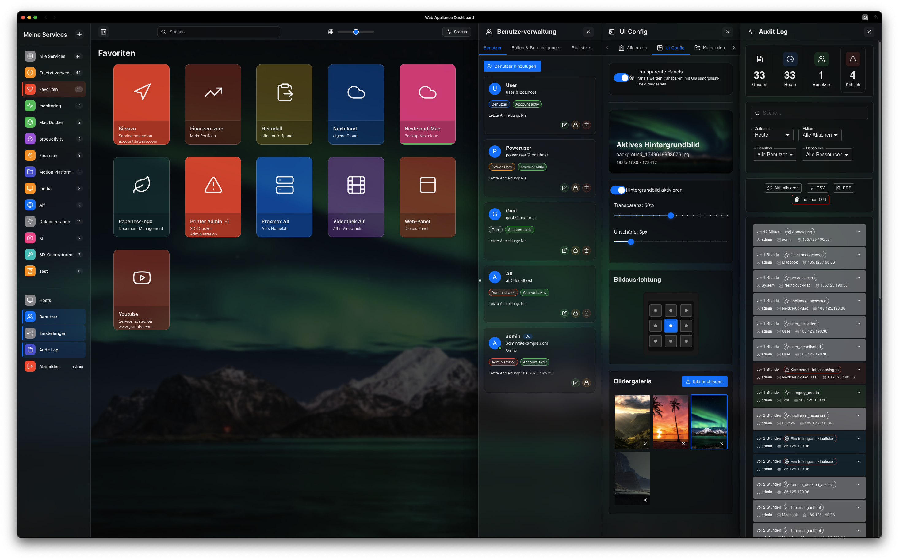
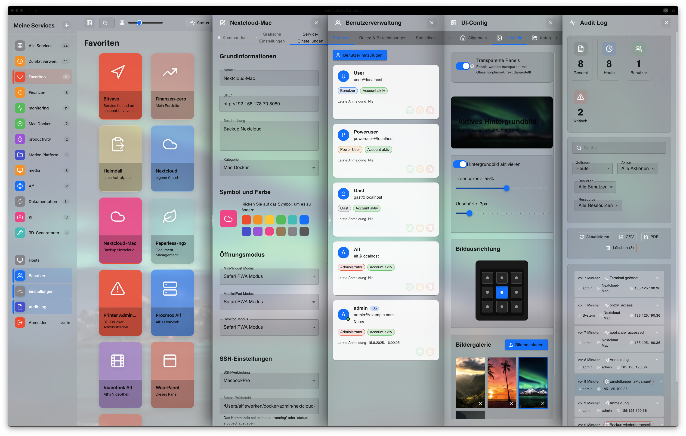
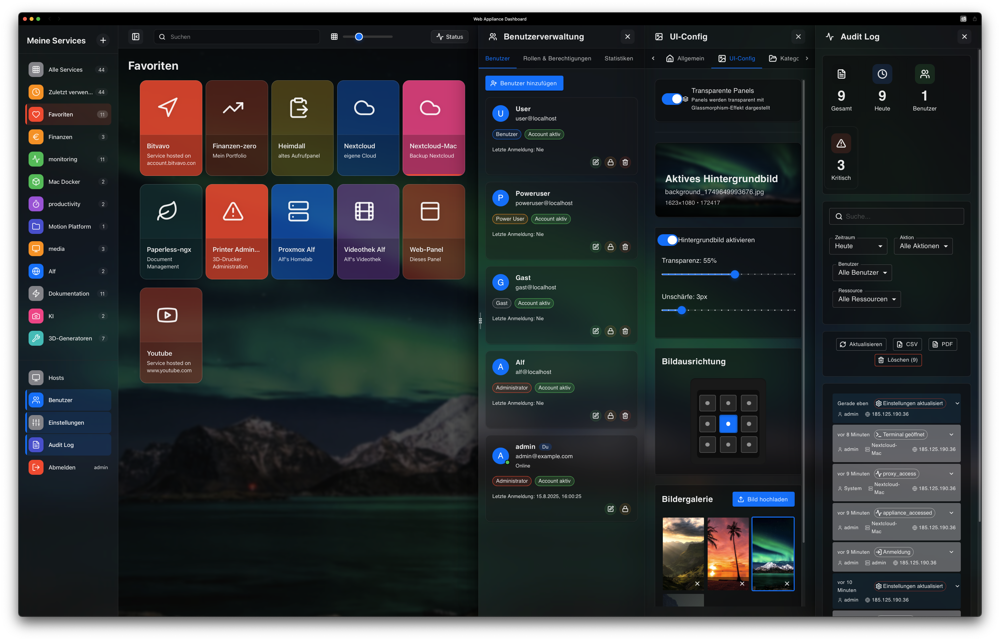
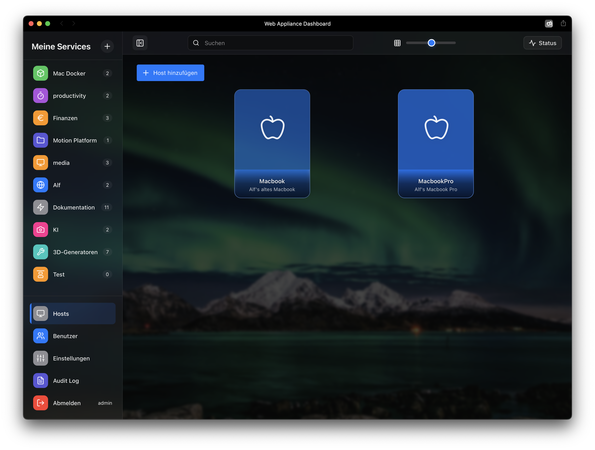
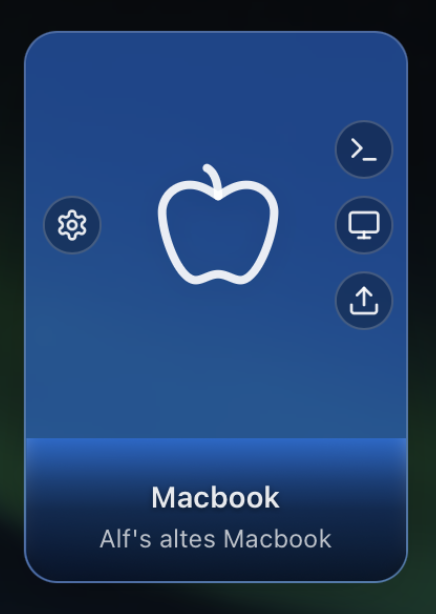
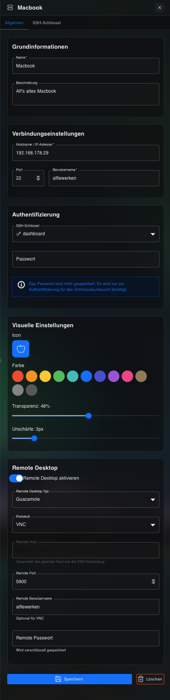
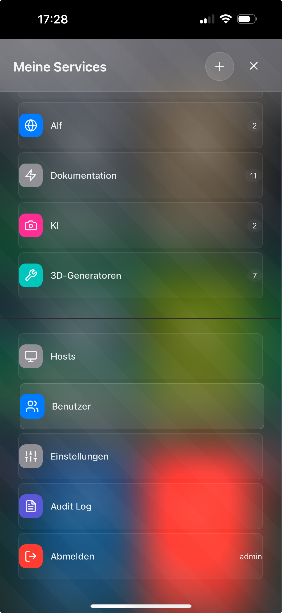
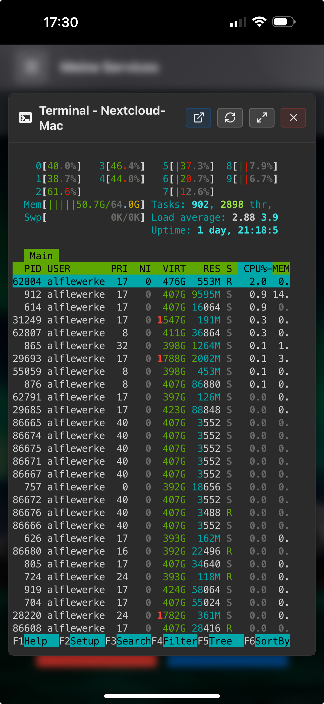
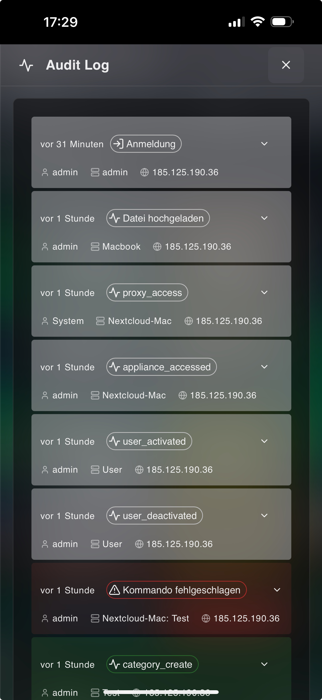
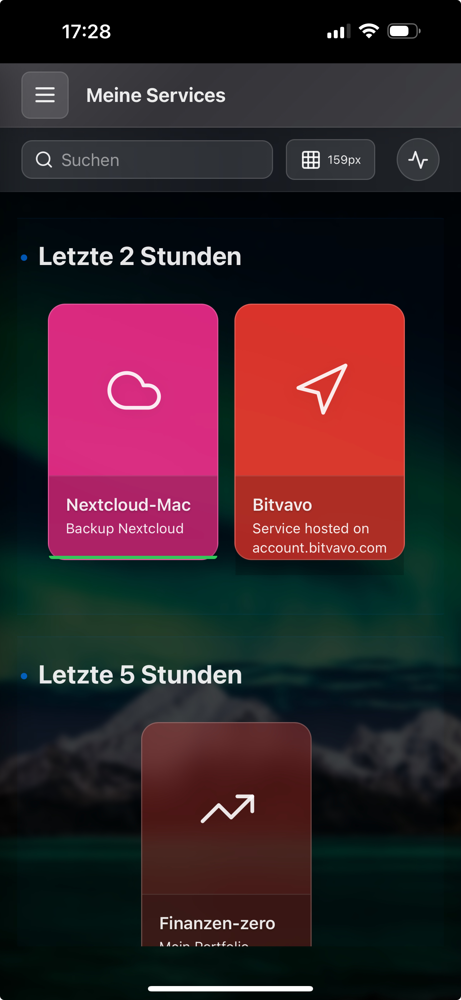

# Web Appliance Dashboard 🚀

🇬🇧 English | [🇩🇪 Deutsch](README.de.md) | [📖 User Guide](docs/user-guide-v2/USER-GUIDE.en.md)

[](https://www.docker.com/)
[](https://nodejs.org/)
[](https://reactjs.org/)
[](LICENSE)
[](package.json)
[](SECURITY.md)

## ⭐ Support the Project

If you find this project useful, please consider giving it a star! It helps others discover the project and motivates continued development.

<div align="center">

[](https://github.com/alflewerken/web-appliance-dashboard/stargazers)
[](https://github.com/alflewerken/web-appliance-dashboard/network)
[](https://github.com/alflewerken/web-appliance-dashboard/watchers)

</div>

> **"From a homelab enthusiast for homelab enthusiasts"**

An elegant, self-hosted dashboard for centralized management of VMs, Docker containers, and services. No cloud dependencies, no subscriptions - just a solid tool for your homelab.



### 🎨 Light & Dark Mode

<div align="center">
<table>
<tr>
<td align="center"><b>Light Mode</b></td>
<td align="center"><b>Dark Mode</b></td>
</tr>
<tr>
<td></td>
<td></td>
</tr>
</table>
</div>

## 🌟 Features

### Core Features
- **📊 Central Dashboard** - Clear management of all services and hosts
- **🔐 Authentication** - JWT-based user management with roles (Admin/User)
- **🖥️ Web Terminal** - Integrated terminal via ttyd with SSH key support
- **🔑 SSH Integration** - Complete SSH key management with automatic authentication
- **🖥️ Remote Desktop** - VNC & RDP support via Apache Guacamole
- **📦 Service Control** - Start/Stop/Status of services via SSH
- **🎨 Clean UI Philosophy** - "Hover-to-Reveal" (Desktop), "Touch-to-Show" (Mobile)
- **📱 Mobile First** - PWA-capable, optimized for iPhone and tablets

### Enterprise Features
- **💾 Backup & Restore** - Complete system backup with encryption
- **📝 Audit Logging** - Compliance-ready with undo function
- **⚡ Real-time Updates** - Server-Sent Events (SSE) for live status
- **🛡️ Security** - Rate limiting, CORS, Helmet.js, CSP
- **🌐 Multi-User** - User management with granular permission system (in development)
- **🔍 Full-text Search** - Quick search across all services
- **💡 Smart Categories** - Automatic grouping with service counter

## 📸 Screenshots

<details>
<summary><b>Show all screenshots</b></summary>

### Dashboard Overview

*Desktop dashboard with Clean UI*

### Host Management

*Host overview with all configured machines*


*Host card with hover-to-reveal buttons*


*Detailed host configuration*

### Mobile Experience

*iPhone dashboard view*


*SSH terminal on iPhone*


*Mobile audit log - compliance-ready*


*Categories with service counter*

</details>

## 🤔 Why Another Dashboard?

Let me be honest - there are many dashboard solutions out there. **So why did I build another one?**

### The Problem I Faced

After trying Portainer, Heimdall, Homer, and countless others, I always ended up with the same frustrations:

- **🔌 Too many browser tabs** - Each service had its own UI, leading to tab chaos
- **🔑 Password fatigue** - Different credentials for every single service
- **📱 Poor mobile experience** - Most dashboards are desktop-only afterthoughts
- **☁️ Cloud dependencies** - Many require external services or phone-home features
- **🎨 Ugly or outdated UIs** - Let's face it, most look like they're from 2010
- **🔧 Over-engineered** - Simple tasks require complex configurations

### My Solution

I built Web Appliance Dashboard to solve **MY** problems, and maybe they're yours too:

✅ **One Dashboard to Rule Them All** - Terminal, remote desktop, Docker, services - all in one place  
✅ **Mobile-First Design** - Built for iPhone first, scales up to desktop beautifully  
✅ **Zero Cloud Dependencies** - Your data stays on YOUR hardware  
✅ **Modern, Clean UI** - Hover-to-reveal philosophy keeps things tidy  
✅ **One-Line Installation** - Because life's too short for complex setups  
✅ **Actually Useful** - Every feature exists because I needed it, not because it was cool to build

**This isn't just another dashboard - it's the dashboard I wish existed.**

## 🏆 Compare With Others

| Feature | Web Appliance Dashboard | Portainer | Heimdall | Homer |
|---------|------------------------|-----------|----------|--------|
| One-Line Install | ✅ | ❌ | ❌ | ❌ |
| Web Terminal | ✅ Built-in | ❌ | ❌ | ❌ |
| Remote Desktop | ✅ Integrated | ❌ | ❌ | ❌ |
| Mobile Optimized | ✅ Mobile-First | ⚠️ | ❌ | ❌ |
| Dark Mode | ✅ | ✅ | ✅ | ✅ |
| SSH Management | ✅ Full | ❌ | ❌ | ❌ |
| Service Control | ✅ | ⚠️ | ❌ | ❌ |
| Cloud-Free | ✅ | ✅ | ✅ | ✅ |
| Modern UI | ✅ React 19 | ⚠️ | ❌ | ⚠️ |
| Backup/Restore | ✅ Encrypted | ❌ | ❌ | ❌ |


## 🚀 Quick Start - One-Line Installation

Install the complete dashboard with a single command:

```bash
curl -sSL https://raw.githubusercontent.com/alflewerken/web-appliance-dashboard/main/install.sh | bash
```

That's it! The installer will:
- ✅ Check Docker prerequisites
- ✅ Download all configuration files
- ✅ Generate secure passwords automatically
- ✅ Create SSL certificates
- ✅ Pull and start all containers
- ✅ Set up the database

After installation, access your dashboard at:
- 🌐 **http://localhost:9080**
- 🔒 **https://localhost:9443** (self-signed certificate)

## 🗑️ Complete Uninstall

To completely remove the Web Appliance Dashboard:

```bash
# Navigate to installation directory
cd ~/web-appliance-dashboard

# Stop and remove all containers, volumes, and networks
docker compose down -v

# Remove the installation directory
cd ~ && rm -rf web-appliance-dashboard

# Optional: Remove Docker images
docker images | grep ghcr.io/alflewerken | awk '{print $3}' | xargs docker rmi -f
```

This will remove:
- All containers
- All volumes (including data)
- All networks
- All configuration files
- All Docker images (optional)

## 🔄 Update

> ⚠️ **IMPORTANT: Before updating, always create a backup through the Web UI!**
> 
> Navigate to **Settings → Backup** in the dashboard and create a full backup.
> This ensures you can restore your configuration and data if needed.

```bash
# Navigate to installation directory
cd ~/web-appliance-dashboard

# Pull latest Docker images and restart
docker compose pull
docker compose up -d
```

That's it! The dashboard will automatically update to the latest version.

### Update Notes
- Database migrations run automatically on startup
- Your data and configuration are preserved
- Check [CHANGELOG.md](https://github.com/alflewerken/web-appliance-dashboard/blob/main/CHANGELOG.md) for version changes

## 🆕 Latest Updates

### 🚀 Version 1.1.4 (August 15, 2025)

#### Installer Improvements
- ✅ **Platform-Specific Fixes** - Resolved sed/awk compatibility between macOS and Linux
- ✅ **Python-Based YAML Handling** - Reliable docker-compose.yml modifications
- ✅ **Automatic Configuration Repair** - Fixes common issues during installation
- ✅ **Better Error Handling** - Clear error messages with solutions

#### Documentation Enhancements
- ✅ **README Restructured** - Features moved to top for better first impression
- ✅ **"Why Another Dashboard?"** - Added personal story and motivation
- ✅ **Comparison Table** - Clear differentiation from competitors
- ✅ **Light/Dark Mode Screenshots** - Visual demonstration of UI themes

#### Technical Improvements
- ✅ **Non-Interactive Mode** - No TTY errors during SSH installations
- ✅ **Docker Detection Enhanced** - Finds Docker in /usr/local/bin (Docker Desktop)
- ✅ **Hostname Detection** - Automatic .local hostname support for macOS (Bonjour/mDNS)
- ✅ **Container Naming Consistency** - All containers use appliance_ prefix

### 🚀 Version 1.1.3 (August 2025)
- ✅ **React 19 Compatibility** - Full support for React 19.1.1
- ✅ **Express 4 Stability** - Resolved routing issues, stable backend
- ✅ **Improved Backup/Restore** - Fixed drag-and-drop functionality
- ✅ **Remote Desktop Fixed** - Guacamole authentication working
- ✅ **Enhanced Documentation** - Added prominent backup warnings before updates

### 📖 New User Guide
- ✅ Comprehensive documentation with 600+ lines
- ✅ Personal story behind the project
- ✅ Mobile-first documentation with iPhone screenshots
- ✅ Practical workflows instead of feature lists
- ✅ Clean UI Philosophy documented

### Host-First Concept
- ✅ Hosts as foundation for all services
- ✅ Improved host management
- ✅ Detailed host configuration
- ✅ SSH key management per host

### UI/UX Improvements
- ✅ Interactive tooltips for collapsed sidebar
- ✅ Toggle functionality for side panels
- ✅ Improved resize functionality for panels
- ✅ No horizontal scrolling in sidebar

### New Features
- ✅ Encryption key dialog after backup
- ✅ Guacamole cache-clear API endpoint
- ✅ Improved SSH host update functionality
- ✅ Terminal error suppressor for clean console

### Bug Fixes
- ✅ Health check issues resolved (ttyd, webserver)
- ✅ SSH file upload hanging at 10% fixed
- ✅ Hostname duplicate check on update corrected
- ✅ Remote desktop after logout works again

## 📋 Prerequisites

- Docker & Docker Compose (v2.0+)
- Linux/macOS/Windows with WSL2
- 2GB RAM (4GB recommended)
- 10GB free disk space

## 🛠️ Installation Methods

### Method 1: One-Line Installation (Recommended)
The easiest way - see [Quick Start](#-quick-start---one-line-installation) above.

### Method 2: Manual Installation (for Development)

#### 1. Clone repository
```bash
git clone https://github.com/alflewerken/web-appliance-dashboard.git
cd web-appliance-dashboard
```

#### 2. Build and start
```bash
./scripts/build.sh --nocache
```

This command:
- ✅ Automatically creates all .env files with secure passwords
- ✅ Builds the frontend application
- ✅ Creates and starts all Docker containers
- ✅ Sets up the database schema
- ✅ Configures all services

### 3. Open dashboard
```
http://localhost:9080
```

Default login:
- **User**: admin
- **Password**: admin123

⚠️ **Important**: Change the default password immediately!

### 4. Create first host
1. Click "Hosts" in the sidebar
2. Click "Add host"
3. Enter host data (IP, SSH credentials)
4. Save - done!

Detailed instructions: [📖 User Guide](docs/user-guide-v2/USER-GUIDE.en.md)

## 📚 Documentation

### 📖 For Users
- **[User Guide](docs/user-guide-v2/USER-GUIDE.en.md)** - Comprehensive guide with personal touch
  - Origin story & motivation
  - 5-minute quick start (Host-First!)
  - Mobile Experience Guide
  - Practical workflows
  - Clean UI Philosophy

### Developer Documentation
- [Developer Guide](docs/developer.html) - Architecture with diagrams
- [API Reference](docs/api-reference-ger.md) - API documentation
- [API Client SDKs](docs/api-client-sdks-ger.md) - Client examples
- [Integration Guide](docs/integration-guide-ger.md) - Integration into existing systems
- [Development Environment](docs/DEVELOPMENT_SETUP-ger.md) - Setting up development environment

### Setup & Configuration
- [Remote Desktop Setup](docs/remote-desktop-setup-guide-ger.md) - Guacamole setup
- [Security Guide](docs/security-best-practices-guide-ger.md) - Security guidelines
- [Performance Tuning](docs/performance-tuning-guide-ger.md) - Optimization
- [Docker Environment](docs/docker-env-setup-ger.md) - Docker configuration

### Technical Documentation
- [Backend Proxy Implementation](docs/BACKEND_PROXY_IMPLEMENTATION-ger.md) - Proxy architecture
- [OpenAPI Specification](docs/openapi.yaml) - API specification

## 🔒 Security

### Integrated Security Features
- **JWT Authentication** - Secure token-based authentication
- **Encrypted Passwords** - AES-256 for remote host passwords
- **Rate Limiting** - Protection against brute force attacks
- **CORS Protection** - Configurable policies
- **SQL Injection Protection** - Prepared statements
- **XSS Prevention** - Input sanitization

### Important Security Notes

⚠️ **Encryption Key**: 
- Generated during setup or entered manually
- Store securely (e.g., password manager)
- Required for password decryption after restore

⚠️ **Best Practices**:
- Change all default passwords
- Use HTTPS with valid certificate
- Create regular backups
- Configure firewall rules

## 🏗️ Architecture

```
┌─────────────────┐     ┌─────────────────┐     ┌─────────────────┐
│ React Frontend  │────▶│  Nginx Proxy    │────▶│  Node.js API    │
│                 │     │   (Port 9080)   │     │   (Port 3001)   │
└─────────────────┘     └─────────────────┘     └─────────────────┘
                                                          │
                        ┌─────────────────┐               │
                        │   Web Terminal  │◀──────────────┤
                        │     (ttyd)      │               │
                        └─────────────────┘               │
                                                          │
                        ┌─────────────────┐               │
                        │    Guacamole    │◀──────────────┤
                        │   (VNC/RDP)     │               │
                        └─────────────────┘               │
                                                          │
                        ┌─────────────────┐               │
                        │    MySQL DB     │◀──────────────┘
                        │   (Port 3306)   │
                        └─────────────────┘
```

## 🛠️ Configuration

### Environment Variables

The most important settings in the `.env` file:

```env
# Ports
PUBLIC_PORT=9080
BACKEND_PORT=3000
FRONTEND_PORT=3001

# Security
JWT_SECRET=<auto-generated>
SSH_KEY_ENCRYPTION_SECRET=<your-encryption-key>

# Database
MYSQL_ROOT_PASSWORD=<auto-generated>
MYSQL_PASSWORD=<auto-generated>

# Features
ENABLE_REMOTE_DESKTOP=true
ENABLE_AUDIT_LOG=true
```

### Docker Compose Override

For specific customizations, create a `docker-compose.override.yml`:

```yaml
version: '3.8'
services:
  webserver:
    ports:
      - "443:443"
    volumes:
      - ./ssl:/etc/nginx/ssl:ro
```

## 🔧 Maintenance

### Create backup
```bash
# Via UI: Settings → Backup → Create backup
# Or via script:
docker exec appliance_backend npm run backup
```

### View logs
```bash
# All services
docker compose logs -f

# Specific service
docker compose logs -f backend
```

### Restart containers
```bash
# All services
docker compose restart

# Single service
docker compose restart backend
```

### Updates
```bash
git pull
docker compose down
docker compose build
docker compose up -d
```

## 📊 Performance

### System Requirements
- **CPU**: 2 cores (4 recommended)
- **RAM**: 2GB minimum (4GB recommended)
- **Disk**: 10GB (20GB recommended)

### Optimizations
- Redis cache (optional)
- CDN for static resources
- Database query optimization
- Connection pooling

## 🐛 Troubleshooting

### Common Issues

**Container won't start:**
```bash
docker compose down -v
docker compose up -d
```

**Forgot password:**
```bash
docker exec appliance_backend npm run reset-admin-password
```

**SSL certificate error:**
- Check Nginx configuration
- Ensure port 443 is available

### Debug Mode

For detailed logs:
```bash
# Adjust .env
NODE_ENV=development
LOG_LEVEL=debug

# Restart containers
docker compose restart backend
```

## 🤝 Contributing

I welcome contributions! See [CONTRIBUTING.md](CONTRIBUTING.md) for details.

### Development Setup
```bash
# Frontend Development
cd frontend
npm install
npm run dev

# Backend Development
cd backend
npm install
npm run dev
```

## 📄 License

This project is licensed under the MIT License - see [LICENSE](LICENSE) for details.


## 🙏 Acknowledgments

- [React](https://reactjs.org/) - UI Framework
- [Express.js](https://expressjs.com/) - Backend Framework
- [Apache Guacamole](https://guacamole.apache.org/) - Remote Desktop
- [ttyd](https://github.com/tsl0922/ttyd) - Web Terminal
- All other [Open Source Projects](package.json) that make this project possible

## 💬 About the Project

> "After 30 years in IT and countless tools later, I just wanted a dashboard that works. No frills, no cloud dependency, no Telemetry, no monthly fees. Just a solid, beautiful tool for my homelab. If it helps you manage your homelab better - mission accomplished!"
>
> *- Alf, 56, IT enthusiast since the Sinclair ZX80*
>
> enjoy!


---

<p align="center">
  Made with ❤️ by <a href="https://github.com/alflewerken">Alf Lewerken</a><br>
  <i>From a homelab enthusiast for homelab enthusiasts</i>
</p>
