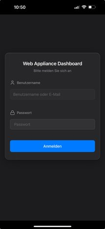
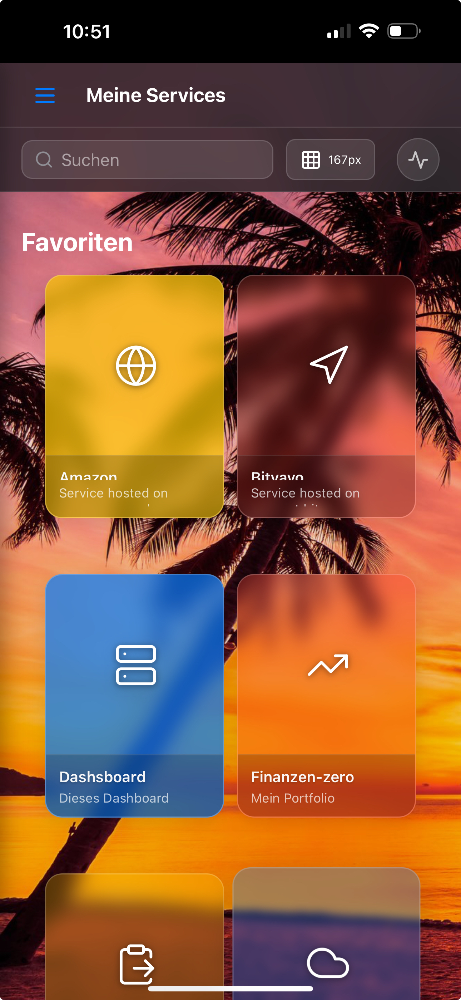
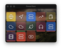

# Web Appliance Dashboard 🚀

[🇬🇧 English](README.en.md) | 🇩🇪 Deutsch

[](https://www.docker.com/)
[](https://nodejs.org/)
[](https://reactjs.org/)
[](LICENSE)

Ein modernes, containerisiertes Dashboard zur zentralen Verwaltung und Überwachung von Web-Appliances, Services und Servern mit integrierter SSH-Funktionalität und Web-Terminal.


## 🌟 Features

### Core Features
- **📊 Zentrales Dashboard** - Übersichtliche Verwaltung aller Appliances
- **🔐 Authentifizierung** - JWT-basierte Benutzerverwaltung mit Rollen
- **🖥️ Web Terminal** - Integriertes Terminal über ttyd
- **🔑 SSH Integration** - Vollständiges SSH-Key Management
- **🖥️ Remote Desktop** - VNC & RDP Support über Guacamole
- **📦 Service Control** - Start/Stop/Status von Services
- **🎨 Anpassbares Design** - Dark/Light Mode, Custom Backgrounds
- **📱 Responsive** - Optimiert für Desktop, Tablet und Mobile
- **🍎 macOS App** - Native Electron App für macOS

### Erweiterte Features
- **💾 Backup & Restore** - Komplette Systemsicherung
- **📝 Audit Logging** - Nachvollziehbare Aktionsprotokolle
- **⚡ Echtzeit-Updates** - Server-Sent Events (SSE)
- **🔄 Auto-Discovery** - Automatische Service-Erkennung
- **🛡️ Sicherheit** - Rate Limiting, CORS, Helmet.js
- **🌐 Multi-User** - Benutzerverwaltung mit Rechtesystem

## 📸 Screenshots

### Login Screen


### Dashboard Übersicht


### Mobile Ansicht
<p align="center">
  
  
</p>

### Service Cards
.png)
*Service Card mit grünem Status - Service läuft*

.png)
*Service Card mit rotem Status - Service gestoppt*

### Terminal Integration

*Integriertes Web-Terminal für SSH-Zugriff*

### Widget Ansicht

*Kompakte Widget-Ansicht für schnellen Zugriff*

### Verwaltung

*Benutzerverwaltung mit Rollenzuweisung*


*Vollständiges Audit-Log aller Aktionen*

## 📋 Voraussetzungen

- Docker & Docker Compose (v2.0+)
- Node.js 18+ (für lokale Entwicklung)
- macOS, Linux oder Windows mit WSL2
- 2GB RAM minimum
- 10GB freier Speicherplatz

## 🚀 Quick Start

### 1. Repository klonen

#### Mit SSH (Empfohlen):
```bash
git clone git@github.com:alflewerken/web-appliance-dashboard.git
cd web-appliance-dashboard
```

#### Mit Personal Access Token:
```bash
# Ersetzen Sie YOUR_TOKEN mit Ihrem GitHub Personal Access Token
git clone https://YOUR_TOKEN@github.com/alflewerken/web-appliance-dashboard.git
cd web-appliance-dashboard
```

> **Hinweis**: Dieses Repository ist privat. Sie benötigen Zugriffsrechte und müssen sich authentifizieren.

## 🚀 Installation

### Option 1: Schnellstart (Empfohlen)

#### 1. Umgebungsvariablen einrichten
```bash
# Automatische Konfiguration
./scripts/setup-env.sh
```

#### 2. Installation starten
```bash
# Komplette Installation mit allen Features
./scripts/build.sh --nocache
```

Dieser Befehl:
- Löscht alle Docker-Caches für eine saubere Installation
- Baut alle Container neu
- Installiert alle Services inklusive Remote Desktop
- Startet das komplette System

### Option 2: Manuelle Installation

#### 1. Umgebungsvariablen konfigurieren

##### Automatisches Setup (empfohlen)
```bash
# Führt Sie durch die Konfiguration und generiert sichere Secrets
./scripts/setup-env.sh
```

##### Manuelles Setup
```bash
# Environment-Datei erstellen
cp .env.example .env

# Backend Environment
cp backend/.env.example backend/.env

# Frontend Environment  
cp frontend/.env.example frontend/.env

# WICHTIG: Passen Sie alle Passwörter und Secret Keys in .env an!
```

Siehe [Docker Environment Setup Guide](docs/docker-env-setup.md) für Details.

#### 2. Docker Container starten

##### Build-Optionen:
```bash
# Standard Installation (mit Remote Desktop)
./scripts/build.sh

# Installation ohne Remote Desktop (kleinerer Footprint)
./scripts/build.sh --no-remote-desktop

# Neuaufbau mit Cache-Löschung (bei Problemen)
./scripts/build.sh --nocache

# Schneller Neustart (für Entwicklung)
./scripts/build.sh --refresh
```

### Nach der Installation

#### Dashboard aufrufen
- **Web Interface**: http://localhost:9080
- **API**: http://localhost:3001
- **Web Terminal**: http://localhost:7681/terminal
- **Guacamole** (Remote Desktop): http://localhost:8080/guacamole

#### Standard Login
- **Benutzer**: admin
- **Passwort**: admin123 (bitte sofort ändern!)


*Neuen Service hinzufügen - einfach und intuitiv*

## 🛠️ Management & Wartung

### Build-Kommandos
```bash
# Standard Installation (mit Remote Desktop)
./scripts/build.sh

# Installation ohne Remote Desktop (kleinerer Footprint)
./scripts/build.sh --no-remote-desktop

# Neuaufbau mit Cache-Löschung (bei Docker-Problemen)
./scripts/build.sh --nocache

# Schneller Neustart für Code-Änderungen (Entwicklung)
./scripts/build.sh --refresh

# macOS App mitbauen
./scripts/build.sh --macos-app
```

### Container-Management
```bash
# Container starten
docker compose up -d

# Container stoppen
docker compose down

# Container-Status prüfen
./status.sh

# Logs anzeigen
docker compose logs -f

# Nur Backend-Logs
docker compose logs -f backend
```

### Wartung & Updates
```bash
# Update auf Remote Desktop nachträglich
./scripts/update-remote-desktop.sh

# Kompletter Neuaufbau (LÖSCHT ALLE DATEN!)
./scripts/clean-build.sh

# Container löschen und neu bauen
./scripts/clean.sh && ./scripts/build.sh
```

### Remote Desktop Services
```bash
# Nur Remote Desktop starten
docker compose up -d guacamole-postgres guacd guacamole

# Nur Remote Desktop stoppen
docker compose stop guacamole-postgres guacd guacamole
```

## 🏗️ Architektur

```
┌─────────────────┐     ┌─────────────────┐     ┌─────────────────┐
│                 │     │                 │     │                 │
│   React SPA     │────▶│  Nginx Proxy    │────▶│  Node.js API    │
│   (Frontend)    │     │   (Port 9080)   │     │   (Port 3001)   │
│                 │     │                 │     │                 │
└─────────────────┘     └─────────────────┘     └─────────────────┘
                                                          │
                        ┌─────────────────┐               │
                        │                 │               │
                        │   Web Terminal  │◀──────────────┤
                        │     (ttyd)      │               │
                        │                 │               │
                        └─────────────────┘               │
                                                          │
                        ┌─────────────────┐               │
                        │                 │               │
                        │    Guacamole    │◀──────────────┤
                        │   (VNC/RDP)     │               │
                        │                 │               │
                        └─────────────────┘               │
                                                          │
                        ┌─────────────────┐               │
                        │                 │               │
                        │    MariaDB      │◀──────────────┘
                        │   (Database)    │
                        │                 │
                        └─────────────────┘
```

## 🎨 Benutzeroberfläche

Das Dashboard bietet eine moderne, intuitive Benutzeroberfläche mit verschiedenen Ansichten:

### Desktop & Tablet

*Responsive Design für alle Bildschirmgrößen*

### Service Management

*Custom Commands für schnelle Aktionen*

### Einstellungen
<p align="center">
  
  
</p>

### SSH & Backup
<p align="center">
  
  
</p>
## 📁 Projektstruktur

```
web-appliance-dashboard/
├── backend/                 # Node.js Express API
│   ├── routes/             # API Endpoints
│   ├── utils/              # Helper Functions
│   ├── uploads/            # File Uploads
│   └── server.js           # Main Server File
├── frontend/               # React SPA
│   ├── src/
│   │   ├── components/     # React Components
│   │   ├── contexts/       # React Contexts
│   │   ├── hooks/          # Custom Hooks
│   │   ├── services/       # API Services
│   │   └── utils/          # Utilities
│   └── build/              # Production Build
├── nginx/                  # Nginx Configuration
├── macos-app/             # Electron macOS App
├── scripts/               # Management Scripts
├── docs/                  # Documentation
├── docker-compose.yml     # Docker Orchestration
└── init.sql              # Database Schema
```

## 🛠️ Entwicklung

### Backend Development
```bash
cd backend
npm install
npm run dev
```

### Frontend Development
```bash
cd frontend
npm install
npm start
```

### macOS App Development
```bash
cd macos-app
npm install
npm run dev
```
## 🔧 Konfiguration

### Wichtige Umgebungsvariablen

#### Backend (.env)
```env
# Database
DB_HOST=database
DB_PORT=3306
DB_USER=dashboard_user
DB_PASSWORD=dashboard_pass123
DB_NAME=appliance_dashboard

# Security
JWT_SECRET=your-secret-key
SSH_KEY_ENCRYPTION_SECRET=your-encryption-key

# Server
PORT=3001
NODE_ENV=production
```

#### Docker Compose Override
Für lokale Entwicklung kann eine `docker-compose.override.yml` erstellt werden:
```yaml
version: '3.8'
services:
  backend:
    volumes:
      - ./backend:/app
    environment:
      NODE_ENV: development
```

## 🔒 Sicherheit

### Best Practices
- ✅ JWT Token Authentication
- ✅ Passwort-Hashing mit bcrypt
- ✅ Rate Limiting für API
- ✅ CORS Protection
- ✅ SQL Injection Protection
- ✅ XSS Protection via Helmet.js
- ✅ SSH Key Encryption

### Empfehlungen
1. Ändern Sie alle Standard-Passwörter
2. Verwenden Sie starke JWT Secrets
3. Aktivieren Sie HTTPS in Production
4. Regelmäßige Security Updates
5. Backup-Strategie implementieren
## 📚 API Dokumentation

Eine vollständige API-Dokumentation ist verfügbar:

- **[API Reference](docs/api-reference.md)** - Detaillierte Endpoint-Dokumentation
- **[OpenAPI/Swagger](docs/openapi.yaml)** - OpenAPI 3.0 Spezifikation
- **[Client Examples](docs/api-reference.md#api-client-beispiele)** - Beispiele in JavaScript, Python, cURL, PHP und Go

### Authentication
```bash
# Login
POST /api/auth/login
Content-Type: application/json
{
  "username": "admin",
  "password": "password"
}

# Response
{
  "token": "eyJhbGciOiJIUzI1NiIs...",
  "user": {
    "id": 1,
    "username": "admin",
    "role": "admin"
  }
}
```

### Appliances
```bash
# Get all appliances
GET /api/appliances
Authorization: Bearer <token>

# Create appliance
POST /api/appliances
Authorization: Bearer <token>
Content-Type: application/json
{
  "name": "My Server",
  "url": "https://server.local",
  "icon": "Server",
  "category": "infrastructure"
}

# Update appliance
PUT /api/appliances/:id
Authorization: Bearer <token>

# Delete appliance
DELETE /api/appliances/:id
Authorization: Bearer <token>
```
### SSH Management
```bash
# Get SSH keys
GET /api/ssh/keys
Authorization: Bearer <token>

# Generate new SSH key
POST /api/ssh/keys/generate
Authorization: Bearer <token>
{
  "name": "production-key",
  "type": "rsa",
  "bits": 4096
}

# Test SSH connection
POST /api/ssh/test
Authorization: Bearer <token>
{
  "host": "192.168.1.100",
  "username": "root",
  "keyId": 1
}
```

## 🚢 Deployment

### Production mit Docker
```bash
# Build und Start
docker-compose -f docker-compose.yml up -d --build

# Logs anzeigen
docker-compose logs -f

# Status prüfen
./status.sh
```

### Kubernetes (coming soon)
```bash
kubectl apply -f k8s/
```

### Backup & Restore
```bash
# Backup erstellen
curl -X POST http://localhost:3001/api/backup/create \
  -H "Authorization: Bearer <token>"

# Backup wiederherstellen
curl -X POST http://localhost:3001/api/restore \
  -H "Authorization: Bearer <token>" \
  -F "backup=@backup-file.zip"
```
## 🧪 Testing

### Backend Tests
```bash
cd backend
npm test
npm run test:watch
```

### Frontend Tests
```bash
cd frontend
npm test
```

### E2E Tests (planned)
```bash
npm run test:e2e
```

## 📖 Weitere Dokumentation

- **[API Reference](docs/api-reference.md)** - Vollständige API-Dokumentation mit Beispielen
- **[OpenAPI Specification](docs/openapi.yaml)** - OpenAPI 3.0 Spezifikation
- [Entwickler-Dokumentation](docs/developer.html)
- [Benutzerhandbuch](docs/user-manual/)
- [API Reference](docs/api-reference.md)
- [Changelog](CHANGELOG.md) (coming soon)

## 🤝 Contributing

Beiträge sind willkommen! Bitte beachten Sie:

1. Fork das Repository
2. Feature Branch erstellen (`git checkout -b feature/AmazingFeature`)
3. Änderungen committen (`git commit -m 'Add some AmazingFeature'`)
4. Branch pushen (`git push origin feature/AmazingFeature`)
5. Pull Request öffnen

### Code Style
- ESLint für JavaScript (coming soon)
- Prettier für Formatierung (coming soon)
- Conventional Commits für Git Messages

## 🐛 Known Issues

- [ ] SSH Key Rotation noch nicht implementiert
- [ ] Multi-Factor Authentication (MFA) fehlt
- [ ] Keine Unterstützung für LDAP/AD Integration
- [ ] Performance bei >1000 Appliances nicht getestet
## 🗺️ Roadmap

### Version 1.1 (Q3 2025)
- [ ] TypeScript Migration
- [ ] API Documentation (Swagger)
- [ ] Enhanced Test Coverage (>80%)
- [ ] GitHub Actions CI/CD

### Version 1.2 (Q4 2025)
- [ ] Multi-Factor Authentication
- [ ] LDAP/Active Directory Integration
- [ ] Prometheus/Grafana Monitoring
- [ ] Internationalization (i18n)

### Version 2.0 (Q1 2026)
- [ ] Kubernetes Support
- [ ] Plugin System
- [ ] GraphQL API
- [ ] Advanced RBAC

## 📊 Performance

- **Startup Zeit**: <5 Sekunden
- **API Response**: <100ms (avg)
- **Memory Usage**: ~200MB (idle)
- **Concurrent Users**: 100+ getestet

## 🛟 Support

- **Issues**: [GitHub Issues](https://github.com/alflewerken/web-appliance-dashboard/issues)
- **Discussions**: [GitHub Discussions](https://github.com/alflewerken/web-appliance-dashboard/discussions)
- **Email**: support@example.com

## 📄 Lizenz

Dieses Projekt ist unter der MIT License lizenziert - siehe [LICENSE](LICENSE) für Details.

## 🙏 Danksagungen

- [React](https://reactjs.org/) - UI Framework
- [Express.js](https://expressjs.com/) - Backend Framework
- [Docker](https://www.docker.com/) - Containerization
- [Apache Guacamole](https://guacamole.apache.org/) - Clientless Remote Desktop Gateway
- [xterm.js](https://xtermjs.org/) - Terminal Emulator
- [ttyd](https://github.com/tsl0922/ttyd) - Share terminal over the web
- [MariaDB](https://mariadb.org/) - Database
- [Nginx](https://nginx.org/) - Web Server
- [Lucide](https://lucide.dev/) - Beautiful Icons

---

<p align="center">
  Made with ❤️ by <a href="https://github.com/alflewerken">Alf Lewerken</a>
</p>

<p align="center">
  <a href="#web-appliance-dashboard-">Back to top</a>
</p>