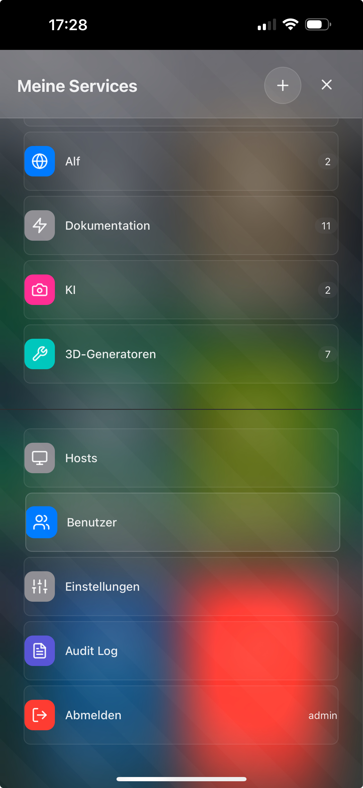
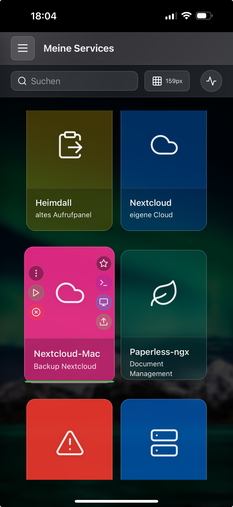

# Web Appliance Dashboard - User Guide

> **"From a homelab enthusiast for homelab enthusiasts"**

## 🎯 The Story Behind It

### The Problem
Imagine this: You want to quickly start an AI development environment. What did I have to do before?

1. Open Proxmox WebUI
2. Stop all GPU-using VMs individually
3. Find and start the right Linux VM with AI tools
4. Wait...
5. Open terminal, establish SSH connection
6. Finally work

Or gaming in the evening?
1. Open Proxmox
2. Stop AI VMs
3. Start gaming VM
4. Open terminal
5. Manually start Moonlight
6. Log in...

**There had to be an easier way!**

### The Solution
A dashboard that:
- **Looks beautiful** - not like from the 90s
- **Is easy to use** - like Homer or Heimdall
- **Is powerful** - with SSH, VNC, RDP, service control
- **Is accessible from anywhere** - secure via VPN
- **Runs self-hosted** - no cloud, no dependencies

---

## 🚀 What is the Web Appliance Dashboard?

### Your Command Center
The Web Appliance Dashboard is your central control point for:
- **Virtual Machines** (Proxmox, VMware, etc.)
- **Docker Containers** 
- **Physical Servers**
- **Network Appliances**
- **Services**

### Who is it for?
- **Homelab enthusiasts** who want to bring order to chaos
- **IT professionals** who work professionally at home too
- **Developers** who need to quickly switch between environments
- **Tinkerers** who value aesthetics and function

### What it is NOT
- Not a replacement for Proxmox/VMware management
- Not a monitoring tool (that's what Grafana is for)
- Not an automation platform (that's what Ansible is for)
- **Instead:** The elegant quick access to everything!

---

## 📸 Dashboard Overview


*Your personal homelab command center - everything at a glance*

### Main Areas

#### 1. **Sidebar (Left)**
- Categories for your services
- Quick access to favorites
- Collapsible for more space

#### 2. **Main Area (Center)**
- Your appliance cards
- Grouped by categories
- Quick actions directly available

#### 3. **Panels (Right)**
- User management
- UI configuration
- Audit log
- Service details

#### 4. **Transparent Panels**
- Live background image remains visible
- Modern glassmorphism effect
- Adjustable transparency (I use 50%)

---

## 📱 Mobile Experience - Full Power in Your Pocket

### The Dashboard on the Go
**Your complete homelab on your smartphone - no compromise!**


*Recently used services - quick access to what matters most*

### Mobile Features

#### **Terminal on iPhone**

*htop directly on iPhone - full SSH power on the go*

**What works:**
- Full terminal with touch support
- Copy & paste works
- Pinch-to-zoom for better readability
- Landscape mode for more space
- All SSH features available

#### **Mobile Audit Log**

*All activities at a glance - even on the go*

**Enterprise Features:**
- **Full Compliance** - All important operations are reversible
- **Detailed Filters** - By user, time period, actions, resources
- **Search Function** - Quick finding of specific events
- **Color Coding** - Green (Success), Red (Error), Yellow (Warning)
- **Exportable** - For compliance reports and audits

#### **Sidebar & Navigation**

*All categories clearly arranged - with service counter*

**Smart Mobile UI:**
- Hamburger menu for categories
- Service counter per category
- Touch-optimized buttons
- Swipe gestures supported

### Mobile-First Design
- **Responsive Cards** - automatically adapt
- **Touch Gestures** - Swipe, pinch, long-press
- **PWA-Ready** - installable as app
- **Offline Capable** - cached for quick start

#### **Clean & Intuitive Interface**

*Service cards with hidden actions - only visible on touch*

**The Thoughtful UI Concept:**
- **Clean by Default** - No cluttered interfaces
- **Actions on Demand** - Buttons appear only on hover (Desktop) or touch (Mobile)
- **Visual Hierarchy** - Important things large, details small
- **Touch-optimized** - Large touch targets on mobile

**The Service Card Buttons (Nextcloud-Mac Example):**

Left Column:
- ⚙️ **Settings** - Configure service
- ▶️ **Start Service** - Boot container/VM
- ⏹️ **Stop Service** - Clean shutdown

Right Column:
- ⭐ **Favorite** - Add to favorites
- 🖥️ **Terminal** - SSH access with one click
- 🖥️ **Remote Desktop** - Start VNC/RDP session
- 📁 **File Transfer** - Drag & drop upload

**Status Display (Bottom Bar):**
- 🟢 **Green** - Service running perfectly
- 🔴 **Red** - Service offline
- 🟡 **Yellow** - Running, but high latency or warning

### Typical Mobile Workflow
1. **Alert on phone** - Service is down
2. **Open dashboard** - via VPN or locally
3. **Identify problem** - Check audit log
4. **Stop and restart service** directly in service card
5. **Open terminal** - or **Remote Desktop** directly in service card
6. If restart wasn't enough, work via terminal
7. **Done!** - Everything in 30 seconds from the couch

---

## ⚡ Quick Start in 5 Minutes

### 1. After Installation
```bash
# Dashboard is accessible at:
http://Your-IP-Address

# Default login:
Username: admin
Password: admin123 (IMPORTANT: Change immediately after installation!)
```

### 2. The Most Important Concept: Hosts First!

**Why Hosts?** Services run on machines - called "Hosts" in the dashboard. No host, no service! That's why we create a host first.

#### Step 1: Open Host Management
1. Click on **"Hosts"** in the sidebar
2. You see the host overview with all already created machines

#### Step 2: Create New Host
1. Click on **"Add Host"** (blue plus symbol)
2. The host panel opens

#### Step 3: Configure Host

**Example: Your old MacBook as Host**

**Basic Information:**
- **Name:** Macbook
- **Description:** Alf's old Macbook

**Connection Settings:**
- **Hostname/IP:** 192.168.178.29
- **Port:** 22
- **Username:** alflewerken

**Authentication:**
- **SSH Key:** ✓ dashboard (recommended)
- **Or Password:** (less secure, but possible)

**Visual Settings:**
- **Icon:** 🍎 (Apple logo or custom icon)
- **Color:** Blue (or your favorite color)
- **Transparency:** 48%

**Remote Desktop (optional):**
- **Enable Remote Desktop:** ✓
- **Type:** VNC or Guacamole
- **Port:** 5900
- **Username:** alflewerken

3. Click **"Save"**

### 3. Understanding the Host Card

After saving, your host appears as a card in the dashboard:


*The host overview with all created hosts*


*The host card with all available actions (visible on hover/touch)*

**The Buttons (appear on hover/touch):**
- ⚙️ **Settings** (left) - Edit host configuration
- 🖥️ **Terminal** (right) - Open SSH connection
- 🖥️ **Remote Desktop** (right) - Start VNC/RDP session
- 📤 **Share** (right) - Transfer files to the host


*The complete host configuration panel*

### 4. Installing Services on the Host

Now that the host is created, you can add services:

1. Switch to **"My Services"**
2. Click on **"Add Service"**
3. Select the host you just created
4. Configure your service (e.g., Docker container, VM, etc.)

### 5. Your First Success!
- Host created ✓
- SSH access works ✓
- Services can be assigned ✓
- **Everything in under 5 minutes!**

**Pro Tip:** Create all your hosts first (Proxmox, NAS, Router, etc.), then assign the services. This keeps things organized!

---

## 🎮 Daily Workflows

### Workflow 1: "The Morning Routine"
**Goal:** Quick status check of all systems

1. Open dashboard (Desktop or Mobile)
2. One glance is enough:
   - Green dots = Everything running
   - Red dots = Attention, service down
3. For problems: Terminal button → Fix problem
4. **Time saved:** 30 seconds instead of 10 minutes

### Workflow 2: "Start AI Development"
**Goal:** Free up GPU resources for AI and start environment

1. Expand "Gaming" category
2. Stop all gaming VMs (Stop button)
3. Expand "AI" category  
4. Start AI VM (Play button)
5. Open terminal → Start Jupyter
6. **Time saved:** 1 minute instead of 15 minutes

### Workflow 3: "Gaming Time!"
**Goal:** Quickly switch from work to gaming

1. Stop all work VMs with one click
2. Start gaming VM
3. Start Moonlight directly from the card
4. **Time saved:** 30 seconds to gaming!

### Workflow 4: "Remote Maintenance from Smartphone"
**Goal:** Quickly intervene from anywhere

1. Connect VPN on iPhone
2. Open dashboard (as PWA or browser)
3. See problem service in "Recent Activities"
4. Open terminal → Restart service
5. Check audit log → Successful!
6. **Advantage:** No laptop needed, iPhone is enough!

---

## 🛠️ The Power Features

### Clean UI Philosophy
**"Show only what's needed, when it's needed"**

The dashboard follows a minimalist design approach:
- **No button cemeteries** - Actions hidden until needed
- **Progressive Disclosure** - Details only on request
- **Context-Aware** - Shows only relevant options
- **Hover-to-Reveal** (Desktop) - Mouse over = buttons visible
- **Touch-to-Show** (Mobile) - Tap once = all options

**Why?**
> "After years with overloaded enterprise tools, I wanted something that doesn't overwhelm. You first see only the services - nicely organized. Want to do something? Hover or touch - then the options appear. This keeps it clean yet powerful."

### SSH & Terminal
**One click to shell - everywhere**

**What makes it special?**
- No separate SSH client needed
- SSH keys securely encrypted stored
- Works from any browser
- Even on iPhone/iPad!

**Use Cases:**
- Quick system check
- Service restart
- Log file analysis
- Configuration adjustments
- Updates and maintenance

### Remote Desktop (VNC/RDP)
**Full desktop in the browser**

Via Apache Guacamole integrated:
- **VNC** for Linux/Mac systems
- **RDP** for Windows machines
- **No client installation** - everything in the browser
- **Clipboard sync** - copy & paste between systems
- **File transfer** - drag & drop

### Service Control
**Direct control over your services**

For each service definable:
- Start/Stop/Restart commands
- Status checks
- Custom commands
- Everything via SSH in the background

### Audit Log & Compliance
**Everything traceable**

- **Who** did **what** **when**?
- Filtering by user, time, action
- Important operations reversible
- Export function for reports
- Compliance-ready!

---

## 🎨 Personalization & Style

### Dark/Light Mode
- Automatic switching by time
- Manual selection
- Saves per user

### Custom Backgrounds
**Your dashboard, your style!**

- Upload your own images
- Different backgrounds per theme
- Blur effect adjustable
- Works on mobile too!

**My tip:** Dark, atmospheric images work best with the transparent panels.

### Icon Libraries
- **Material Icons** - Google's icon set
- **Simple Icons** - Logos of services (Proxmox, Docker, etc.)
- **Emoji** - Because why not? 🚀

### Categories
Create your own structure:
- Gaming
- Productivity
- Development
- Media
- Infrastructure
- Or whatever you want!

---

## 💡 Tips from the Developer

### Tip #1: SSH Keys instead of passwords
Generate an SSH key pair during setup and distribute the public key to all your hosts. Safer and more convenient!

### Tip #2: Use categories wisely
I have my services organized like this:
- **Infrastructure** - Proxmox, Router, NAS
- **Development** - Git, CI/CD, Databases
- **Media** - Plex, Photos, Backup
- **Gaming** - Gaming VMs, Sunshine
- **AI** - Jupyter, LLM servers

### Tip #3: Favorites for quick access
Mark your 5-6 most important services as favorites. They always appear at the top.

### Tip #4: Mobile as PWA
Install the dashboard as Progressive Web App on your iPhone. Feels like a native app!

### Tip #5: VPN is your friend
Never expose the dashboard directly to the internet. Always use VPN (WireGuard, OpenVPN).

### Tip #6: Regular backups
The backup function saves everything - including encrypted passwords. Store the key securely!

### Tip #7: Use the audit log
Not just for compliance - also great for troubleshooting. "What did I change yesterday?"

### Tip #8: Don't be surprised if no buttons are visible at first
That's intentional! The Clean UI philosophy hides actions until you need them. Hover (desktop) or tap (mobile) to see all options.

---

## 🔧 Advanced Configuration

### Environment Variables
The most important settings in `.env`:

```bash
# Security
JWT_SECRET=<generate-with-setup-script>
SSH_KEY_ENCRYPTION_SECRET=<your-key>

# Ports
PUBLIC_PORT=9080
TTYD_PORT=7681

# Features
FEATURE_AUDIT_LOG=true
FEATURE_BACKUP_RESTORE=true
FEATURE_SSH_TERMINAL=true
FEATURE_REMOTE_DESKTOP=true
```

### Docker Compose Customizations
Create a `docker-compose.override.yml` for your customizations:

```yaml
version: '3.8'
services:
  webserver:
    ports:
      - "443:443"  # HTTPS
    volumes:
      - ./ssl:/etc/nginx/ssl:ro
```

### Database
- MySQL/MariaDB in container
- Automatic backups
- Restore possible via UI

---

## 🚨 Troubleshooting

### "Connection Refused" to service
- Is the host online?
- Correct IP/hostname?
- Firewall rules checked?
- SSH service running?

### "Authentication Failed"
- Correct username?
- SSH key distributed?
- Password correct?
- User has permissions?

### Dashboard not loading
```bash
docker-compose logs -f
docker-compose restart
```

### Forgot password
```bash
docker exec appliance_backend npm run reset-admin-password
```

### Backup won't restore
- Correct encryption key?
- Backup file intact?
- Enough disk space?

---

## 🗺️ Roadmap

### Coming Soon (v1.2)
- [ ] Multi-user finally working properly
- [ ] Role-based permissions
- [ ] 2-factor authentication
- [ ] Docker Compose control

### Planned (v1.3)
- [ ] Metrics dashboard (CPU, RAM, Network)
- [ ] Alerting via Telegram/Discord
- [ ] Auto-discovery of services
- [ ] Proxmox integration

### Future (v2.0)
- [ ] Kubernetes support
- [ ] Terraform integration
- [ ] AI assistant ("Start all dev VMs")
- [ ] Mobile app (React Native)

---

## 🤝 Community & Support

### Found a bug?
Create an issue on GitHub with:
- Exact error description
- Steps to reproduce
- Screenshots if possible
- Browser console output

### Have an idea?
Open a feature request! I'm happy about suggestions.

### Want to contribute?
Pull requests are welcome! Please read CONTRIBUTING.md first.

### Need help?
- Check the documentation
- Search existing issues
- Ask in discussions

---

## 📝 Closing Words from the Developer

> "After 30 years in IT and countless companies later, I just wanted a tool that works. No frills, no cloud dependency, no monthly fees. Just a solid, beautiful dashboard for my homelab.
> 
> The situation was frustrating: Proxmox here, Docker there, SSH in terminal, VNC in another tool. Everything scattered, nothing uniform. And the existing solutions? Either too simple (just links) or too complex (Kubernetes-style).
> 
> So I developed this dashboard in my spare time. With everything I need myself: SSH with one click, service control directly from the card, remote desktop without extra software, and the whole thing also nice to look at.
> 
> If it helps you manage your homelab better - mission accomplished! It's not perfect yet (multi-user still needs work), but it should be enough for hobby use.
> 
> And hey, at 56, programming is still fun for me. Especially when others can benefit from it.
> 
> Happy Homelabbing!"
> 
> *- Alf, 56, IT enthusiast since the Sinclair ZX80, grown up on SGI (formerly SiliconGraphics), Sun, IBM, HP Hardware from Workstations to enterprise scale Server farms -*

---

## 📊 My Personal Setup

Maybe as inspiration:

**Hardware:**
- Proxmox Server: Intel NUC 12 Pro (i7, 64GB RAM, 2TB NVMe)
- NAS: Synology DS920+ (4x 8TB)
- Network: UniFi Dream Machine Pro
- Gaming VM: GTX 4070 via PCIe Passthrough

**VMs & Container:**
- 3x Ubuntu VMs for Kubernetes experiments
- 1x Windows 11 for gaming (Sunshine/Moonlight)
- 1x Ubuntu with CUDA for AI development
- 15+ Docker containers (GitLab, Nextcloud, etc.)

**This Dashboard manages all of it!** From gaming in the evening to AI experiments at night - everything with one click.

---

## 🙏 Thanks

To the open source community, without which none of this would exist.

To you, for trying out my dashboard!

---

**Version:** 1.1.2  
**Last Updated:** August 2025  
**Author:** Alf Lewerken  
**License:** MIT

---

<p align="center">
  <i>Made with ❤️ and lots of ☕ in Germany</i>
</p>
