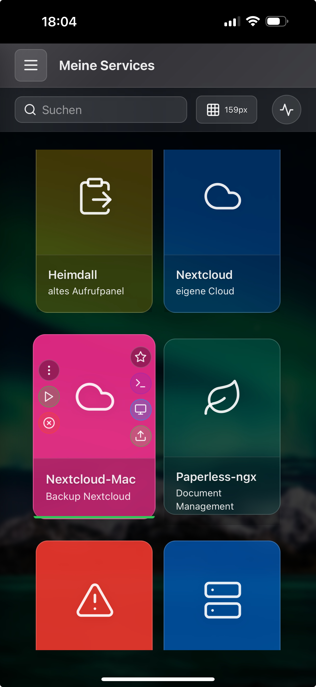

# Web Appliance Dashboard - Benutzerhandbuch

> **"Von einem Homelab-Enthusiasten für Homelab-Enthusiasten"**

## 🎯 Die Geschichte dahinter

### Das Problem
Stellen Sie sich vor: Sie wollen schnell eine KI-Entwicklungsumgebung starten. Was musste ich vorher tun?

1. Proxmox WebUI öffnen
2. Alle GPU-nutzenden VMs einzeln stoppen
3. Die richtige Linux-VM mit KI-Tools finden und starten
4. Warten...
5. Terminal öffnen, SSH-Verbindung aufbauen
6. Endlich arbeiten

Oder Gaming am Abend?
1. Proxmox öffnen
2. KI-VMs stoppen
3. Gaming-VM starten
4. Terminal öffnen
5. Moonlight manuell starten
6. Einloggen...

**Das musste doch einfacher gehen!**

### Die Lösung
Ein Dashboard, das:
- **Schön aussieht** - nicht wie aus den 90ern
- **Einfach zu bedienen ist** - wie Homer oder Heimdall
- **Mächtig ist** - mit SSH, VNC, RDP, Service-Control
- **Von überall erreichbar ist** - sicher über VPN
- **Self-Hosted läuft** - keine Cloud, keine Abhängigkeiten

---

## 🚀 Was ist das Web Appliance Dashboard?

### Ihre Kommandozentrale
Das Web Appliance Dashboard ist Ihre zentrale Schaltstelle für:
- **Virtuelle Maschinen** (Proxmox, VMware, etc.)
- **Docker Container** 
- **Physische Server**
- **Netzwerk-Appliances**
- **Services und Dienste**

### Für wen ist es gemacht?
- **Homelab-Enthusiasten** die Ordnung ins Chaos bringen wollen
- **IT-Profis** die auch zuhause professionell arbeiten
- **Entwickler** die schnell zwischen Umgebungen wechseln
- **Tüftler** die Wert auf Ästhetik und Funktion legen

### Was es NICHT ist
- Kein Ersatz für Proxmox/VMware Management
- Kein Monitoring-Tool (dafür gibt's Grafana)
- Keine Automatisierungs-Plattform (dafür gibt's Ansible)
- **Sondern:** Der elegante Schnellzugriff auf alles!

---

## 📸 Das Dashboard im Überblick


*Ihr persönliches Homelab Command Center - alles auf einen Blick*

### Die Hauptbereiche

#### 1. **Sidebar (Links)**
- Kategorien für Ihre Services
- Schnellzugriff auf Favoriten
- Zusammenklappbar für mehr Platz

#### 2. **Hauptbereich (Mitte)**
- Ihre Appliance-Karten
- Gruppiert nach Kategorien
- Quick-Actions direkt verfügbar

#### 3. **Panels (Rechts)**
- Benutzerverwaltung
- UI-Konfiguration
- Audit Log
- Service-Details

#### 4. **Transparente Panels**
- Live-Hintergrundbild bleibt sichtbar
- Moderner Glassmorphism-Effekt
- Anpassbare Transparenz (ich nutze 50%)

---

## 📱 Mobile Experience - Volle Power in der Hosentasche

### Das Dashboard unterwegs
**Ihr komplettes Homelab auf dem Smartphone - kein Kompromiss!**


*Zuletzt verwendete Services - schneller Zugriff auf das Wichtigste*

### Mobile Features

#### **Terminal auf dem iPhone**

*htop direkt auf dem iPhone - volle SSH-Power unterwegs*

**Was geht:**
- Vollwertiges Terminal mit Touch-Unterstützung
- Copy & Paste funktioniert
- Pinch-to-Zoom für bessere Lesbarkeit
- Landscape-Mode für mehr Platz
- Alle SSH-Features verfügbar

#### **Audit Log mobil**

*Alle Aktivitäten im Blick - auch unterwegs*

**Enterprise-Features:**
- **Vollständige Compliance** - Alle wichtigen Operationen sind umkehrbar
- **Detaillierte Filter** - Nach User, Zeitraum, Aktionen, Ressourcen
- **Suchfunktion** - Schnelles Finden spezifischer Events
- **Farbcodierung** - Grün (Erfolg), Rot (Fehler), Gelb (Warnung)
- **Export-fähig** - Für Compliance-Reports und Audits

#### **Sidebar & Navigation**

*Alle Kategorien übersichtlich - mit Service-Counter*

**Smart Mobile UI:**
- Hamburger-Menü für Kategorien
- Service-Zähler pro Kategorie
- Touch-optimierte Buttons
- Swipe-Gesten unterstützt

### Mobile-First Design
- **Responsive Cards** - passen sich automatisch an
- **Touch-Gesten** - Swipe, Pinch, Long-Press
- **PWA-Ready** - installierbar als App
- **Offline-Fähig** - Cached für schnellen Start

#### **Clean & Intuitive Interface**

*Service-Karten mit versteckten Aktionen - erst bei Touch sichtbar*

**Das durchdachte UI-Konzept:**
- **Clean by Default** - Keine überladenen Interfaces
- **Actions on Demand** - Buttons erscheinen erst bei Hover (Desktop) oder Touch (Mobile)
- **Visuelle Hierarchie** - Wichtiges groß, Details klein
- **Touch-optimiert** - Große Touch-Targets auf Mobile

**Die Service-Karten Buttons (Nextcloud-Mac Beispiel):**

Linke Spalte:
- ⚙️ **Einstellungen** - Service konfigurieren
- ▶️ **Service starten** - Container/VM hochfahren
- ⏹️ **Service stoppen** - Sauber herunterfahren

Rechte Spalte:
- ⭐ **Favorit** - Zu Favoriten hinzufügen
- 🖥️ **Terminal** - SSH-Zugriff mit einem Klick
- 🖥️ **Remote Desktop** - VNC/RDP Session starten
- 📁 **Datei übertragen** - Drag & Drop Upload

**Status-Anzeige (Balken unten):**
- 🟢 **Grün** - Service läuft einwandfrei
- 🔴 **Rot** - Service ist offline
- 🟡 **Gelb** - Läuft, aber hohe Latenz oder Warnung

### Typischer Mobile-Workflow
1. **Alarm auf dem Handy** - Service ist down
2. **Dashboard öffnen** - über VPN oder lokal
3. **Problem identifizieren** - Audit Log checken
4. **Service direkt in der Service-Karte** stoppen und neu starten
4. **Terminal öffnen** - oder **Remote Desktop** direkt in der Service-Karte
5. Wenn Neustart nicht ausgereicht hat, über Terminal arbeiten
6. **Fertig!** - Alles in 30 Sekunden vom Sofa aus

---

## ⚡ Schnellstart in 5 Minuten

### 1. Nach der Installation
```bash
# Dashboard ist erreichbar unter:
http://Ihre-IP-Adresse

# Standard-Login:
Username: admin
Password: admin123 (WICHTIG: Sofort nach Installation ändern!)
```

### 2. Das wichtigste Konzept: Hosts zuerst!

**Warum Hosts?** Services laufen auf Rechnern - im Dashboard "Hosts" genannt. Ohne Host kein Service! Deshalb legen wir zuerst einen Host an.

#### Schritt 1: Host-Verwaltung öffnen
1. Klicken Sie in der Sidebar auf **"Hosts"**
2. Sie sehen die Host-Übersicht mit allen bereits angelegten Rechnern

#### Schritt 2: Neuen Host anlegen
1. Klicken Sie auf **"Host hinzufügen"** (blaues Plus-Symbol)
2. Das Host-Panel öffnet sich

#### Schritt 3: Host konfigurieren

**Beispiel: Ihr altes MacBook als Host**

**Grundinformationen:**
- **Name:** Macbook
- **Beschreibung:** Alf's altes Macbook

**Verbindungseinstellungen:**
- **Hostname/IP:** 192.168.178.29
- **Port:** 22
- **Benutzername:** alflewerken

**Authentifizierung:**
- **SSH-Schlüssel:** ✓ dashboard (empfohlen)
- **Oder Passwort:** (weniger sicher, aber möglich)

**Visuelle Einstellungen:**
- **Icon:** 🍎 (Apple-Logo oder eigenes Icon)
- **Farbe:** Blau (oder Ihre Lieblingsfarbe)
- **Transparenz:** 48%

**Remote Desktop (optional):**
- **Remote Desktop aktivieren:** ✓
- **Typ:** VNC oder Guacamole
- **Port:** 5900
- **Benutzername:** alflewerken

3. Klicken Sie auf **"Speichern"**

### 3. Host-Karte verstehen

Nach dem Speichern erscheint Ihr Host als Karte im Dashboard:


*Die Host-Übersicht mit allen angelegten Hosts*


*Die Host-Karte mit allen verfügbaren Aktionen (bei Hover/Touch sichtbar)*

**Die Buttons (erscheinen bei Hover/Touch):**
- ⚙️ **Einstellungen** (links) - Host-Konfiguration bearbeiten
- 🖥️ **Terminal** (rechts) - SSH-Verbindung öffnen
- 🖥️ **Remote Desktop** (rechts) - VNC/RDP Session starten
- 📤 **Datei übertrgaen** (rechts) - Datei zum Rechner übertragen


*Das komplette Host-Konfigurationspanel*

### 4. Services auf dem Host installieren

Jetzt wo der Host angelegt ist, können Sie Services hinzufügen:

1. Wechseln Sie zu **"Meine Services"**
2. Klicken Sie auf **"Service hinzufügen"**
3. Wählen Sie den eben erstellten Host aus
4. Konfigurieren Sie Ihren Service (z.B. Docker Container, VM, etc.)

### 5. Ihr erster Erfolg!
- Host ist angelegt ✓
- SSH-Zugriff funktioniert ✓
- Services können zugeordnet werden ✓
- **Alles in unter 5 Minuten!**

**Pro-Tipp:** Legen Sie zuerst alle Ihre Hosts an (Proxmox, NAS, Router, etc.), dann ordnen Sie die Services zu. So behalten Sie die Übersicht!

---

## 🎮 Alltägliche Workflows

### Workflow 1: "Die Morgen-Routine"
**Ziel:** Schneller Status-Check aller Systeme

1. Dashboard öffnen (Desktop oder Mobile)
2. Ein Blick genügt:
   - Grüne Punkte = Alles läuft
   - Rote Punkte = Achtung, Service down
3. Bei Problemen: Terminal-Button → Problem beheben
4. **Zeitersparnis:** 30 Sekunden statt 10 Minuten

### Workflow 2: "KI-Entwicklung starten"
**Ziel:** GPU-Ressourcen für KI freimachen und Umgebung starten

1. Kategorie "Gaming" aufklappen
2. Alle Gaming-VMs stoppen (Stop-Button)
3. Kategorie "KI" aufklappen  
4. KI-VM starten (Play-Button)
5. Terminal öffnen → Jupyter starten
6. **Zeitersparnis:** 1 Minute statt 15 Minuten

### Workflow 3: "Gaming Time!"
**Ziel:** Schnell von Arbeit auf Gaming umschalten

1. Alle Arbeits-VMs mit einem Klick stoppen
2. Gaming-VM starten
3. Moonlight direkt aus der Karte starten
4. **Zeitersparnis:** 30 Sekunden bis zum Gaming!

### Workflow 4: "Remote-Wartung vom Smartphone"
**Ziel:** Von unterwegs schnell eingreifen

1. VPN auf dem iPhone verbinden
2. Dashboard öffnen (als PWA oder Browser)
3. Problem-Service in "Letzte Aktivitäten" sehen
4. Terminal öffnen → Service neustarten
5. Audit Log prüfen → Erfolgreich!
6. **Vorteil:** Kein Laptop nötig, iPhone reicht!

---

## 🛠️ Die Power-Features

### Clean UI Philosophy
**"Zeige nur was nötig ist, wenn es nötig ist"**

Das Dashboard folgt einem minimalistischen Design-Ansatz:
- **Keine Button-Friedhöfe** - Aktionen versteckt bis benötigt
- **Progressive Disclosure** - Details nur auf Anfrage
- **Context-Aware** - Zeigt nur relevante Optionen
- **Hover-to-Reveal** (Desktop) - Maus drüber = Buttons sichtbar
- **Touch-to-Show** (Mobile) - Einmal antippen = Alle Optionen

**Warum?**
> "Nach Jahren mit überladenen Enterprise-Tools wollte ich etwas, das nicht erschlägt. Man sieht erstmal nur die Services - schön aufgeräumt. Will man was tun, hover oder touch - dann erscheinen die Optionen. So bleibt es clean und trotzdem mächtig."

### SSH & Terminal
**Ein Klick zur Shell - überall**

**Was macht es besonders?**
- Kein separater SSH-Client nötig
- SSH-Keys sicher verschlüsselt gespeichert
- Funktioniert auf jedem Gerät mit Browser
- Copy&Paste funktioniert perfekt
- **Mobile:** Touch-optimiert mit Zoom

**Typische Nutzung:**
```bash
# Docker Container neustarten
docker restart nginx

# Logs checken
tail -f /var/log/syslog

# Quick-Updates
apt update && apt upgrade -y

# System-Monitoring
htop
```

### Remote Desktop (VNC/RDP)
**Grafischer Zugriff ohne Zusatz-Software**

**Unterstützte Protokolle:**
- **VNC** für Linux/Unix Systeme
- **RDP** für Windows Systeme  
- **RustDesk** für optimale Performance (muss installiert sein)
- **Bald:** Sunshine/Moonlight für Gaming

**Setup in 30 Sekunden:**
1. In der Appliance-Karte → Settings
2. Remote Desktop aktivieren
3. Protokoll wählen (VNC/RDP)
4. Credentials eingeben
5. Speichern → Fertig!

### Service Control
**Start, Stop, Status - alles im Griff**

**Was geht?**
- Docker Container starten/stoppen
- Systemd Services verwalten
- Custom Commands ausführen
- Status in Echtzeit

**Beispiel Custom Commands:**
```bash
# Backup starten
/scripts/backup.sh

# Cache leeren
redis-cli FLUSHALL

# Logs rotieren
logrotate -f /etc/logrotate.conf

# Docker Cleanup
docker system prune -af
```

### Dateitransfer
**Drag & Drop File Upload**

**So einfach:**
1. File Transfer Button klicken
2. Zielverzeichnis wählen
3. Dateien ins Fenster ziehen
4. Upload läuft!

**Features:**
- Multi-File Upload
- Fortschrittsanzeige
- Bis zu 10GB pro File
- Verschlüsselte Übertragung
- Resume bei Unterbrechung

---

## 🎨 Personalisierung & Style

### Dark Mode vs Light Mode
**Passen Sie das Dashboard Ihrer Umgebung an**

**Dark Mode** (Standard):
- Augenschonend bei Nacht
- Besserer Kontrast
- Stromsparen auf OLED
- Perfekt für dunkle Räume

**Light Mode:**
- Tagsüber im hellen Büro
- Klassischer Look
- Bessere Lesbarkeit bei Sonnenlicht
- Reduzierte Transparenz automatisch

### Hintergrundbilder
**Machen Sie es zu IHREM Dashboard**

**Eigene Bilder:**
1. Einstellungen → UI Config
2. "Upload Background"
3. Bild auswählen (max 5MB)
4. Transparenz anpassen (50% ist optimal)

oder einfach ein Bild in die Desktop-Anwendung draggen.

### Glassmorphism-Effekte
**Der moderne Look**

**Anpassbar:**
- **Transparenz:** 0-100% (ich nutze 50%)
- **Blur-Effekt:** 0-20px (8px ist optimal)
- **Farb-Overlays:** Anpassbar pro Karte
- **Card-Größen:** S/M/L

**Tipp:** Bei älteren Geräten Blur reduzieren für bessere Performance!

---

## 💡 Tipps & Tricks vom Entwickler

### Tipp 1: Favoriten clever nutzen
> "Ich habe meine 5 wichtigsten Services als Favoriten. So sind sie immer ganz oben, egal welche Kategorie aktiv ist."

### Tipp 2: Kategorien = Workflows
> "Erstellen Sie Kategorien nach Workflows, nicht nach Typ. Z.B. 'Entwicklung', 'Gaming', 'Medien' statt 'VMs', 'Container', 'Bare-Metal'."

### Tipp 3: SSH-Keys statt Passwörter
> "Einmal SSH-Key hinterlegen, nie wieder Passwort eingeben. Sicherer und bequemer!"

### Tipp 4: Custom Icons von Simple Icons
> "Simple Icons hat über 2000 Marken-Icons. Nextcloud, Proxmox, TrueNAS - alles dabei!"

### Tipp 5: Backup-Verschlüsselung ernst nehmen
> "Bei jedem Backup wird ein neuer Schlüssel generiert. Speichern Sie ihn in Ihrem Passwort-Manager - ohne ihn sind die Passwörter weg!"

### Tipp 6: Mobile als PWA installieren
> "Auf dem iPhone: Safari → Teilen → Zum Home-Bildschirm. Fühlt sich an wie eine native App!"

### Tipp 7: Docker-Entwicklung vereinfachen
> "Ich habe eine 'Docker-Dev' Kategorie mit allen Test-Containern. Ein Klick stoppt alle, wenn ich fertig bin."

### Tipp 8: Das Clean UI verstehen
> "Nicht wundern wenn erstmal keine Buttons zu sehen sind - das ist Absicht! Hover oder Touch, dann kommen sie. So bleibt alles aufgeräumt und man wird nicht von 20 Buttons pro Karte erschlagen."

---

## 🔧 Erweiterte Konfiguration

### Multi-User Setup (Beta)
**Verschiedene Benutzer, verschiedene Rechte**

**Admin kann:**
- Alles
- User verwalten
- System-Backups
- Alle Appliances sehen/bearbeiten

**User kann:**
- Zugewiesene Appliances nutzen
- Eigene SSH-Keys verwalten
- UI personalisieren
- Kein Zugriff auf Admin-Features

**Hinweis:** Multi-User ist noch in Entwicklung. Für Familien-Homelabs reicht es, für Firmen noch nicht.

### Backup & Restore
**Ihre Konfiguration sicher gespeichert**

**Was wird gesichert?**
- Alle Appliances
- SSH-Keys (verschlüsselt)
- User-Accounts
- UI-Einstellungen
- Audit-Logs

**Backup erstellen:**
1. Settings → Backup
2. "Create Backup" klicken
3. **WICHTIG:** Encryption Key sofort kopieren!
4. Key in Passwort-Manager speichern
5. Backup-File herunterladen

**Restore:**
1. Settings → Restore
2. Backup-File hochladen
3. Encryption Key eingeben
4. Restore starten
5. Fertig!

### API für Automatisierung
**Integrieren Sie das Dashboard**

```javascript
// Beispiel: Service Status abfragen
fetch('http://dashboard/api/appliances/1/service-status', {
  headers: {
    'Authorization': 'Bearer YOUR_TOKEN'
  }
})
.then(res => res.json())
.then(data => console.log(data.status));

// Beispiel: VM starten
fetch('http://dashboard/api/appliances/5/start', {
  method: 'POST',
  headers: {
    'Authorization': 'Bearer YOUR_TOKEN'
  }
});
```

---

## 🚨 Troubleshooting

### Problem: "Kann mich nicht einloggen"
**Lösung:**
```bash
# Admin-Passwort zurücksetzen
docker exec -it appliance_backend npm run reset-admin
# Oder neuen Admin erstellen:
./scripts/create-admin-user.sh
```

### Problem: "Terminal funktioniert nicht"
**Checklist:**
1. SSH auf dem Host aktiviert?
2. Port 22 erreichbar?
3. SSH-Key korrekt hinterlegt?
4. User hat Shell-Zugriff?
5. Auf Mobile: Zoom rauszoomen für bessere Touch-Targets

### Problem: "Remote Desktop zeigt schwarzen Bildschirm"
**Lösungen:**
- VNC: Display :0 oder :1 probieren
- RDP: Network Level Authentication deaktivieren
- Guacamole neustarten: `docker restart appliance_guacamole`
- Token-Cache leeren in Settings

### Problem: "Services werden als offline angezeigt"
**Debug-Schritte:**
1. Terminal öffnen
2. `systemctl status servicename`
3. Service-Konfiguration in Appliance prüfen
4. Custom Command anpassen

### Problem: "Mobile Layout ist verschoben"
**Lösungen:**
- Browser-Cache leeren
- Als PWA neu installieren
- Zoom auf 100% zurücksetzen
- Landscape-Mode probieren

---

## 🗺️ Die Roadmap

### Coming Soon (v1.2)
- ✨ **Sunshine/Moonlight Integration** - Gaming ohne Grenzen
- 📊 **Metriken-Dashboard** - CPU, RAM, Disk auf einen Blick
- 🔄 **Auto-Discovery** - Findet Services automatisch im Netzwerk
- 📱 **Verbesserte Mobile Experience** - Native Gesten-Support

### Geplant (v2.0)
- 🤖 **KI-Assistant** - "Hey Dashboard, starte alle Development VMs"
- 📈 **Grafana Integration** - Metriken direkt eingebettet
- 🔐 **2FA/MFA** - Noch mehr Sicherheit
- 🌍 **Multi-Site Support** - Mehrere Standorte verwalten
- 👥 **Echtes Multi-User** - Mit Gruppen und Permissions

### Community-Wünsche
- Portainer Integration
- Proxmox Backup Server Support
- Wake-on-LAN für physische Maschinen
- Kubernetes Dashboard Integration

### Ihre Ideen?
GitHub Issues sind willkommen! Oder schreiben Sie mir direkt.

---

## 🤝 Community & Support

### GitHub
**Repository:** [github.com/alflewerken/web-appliance-dashboard](https://github.com/alflewerken/web-appliance-dashboard)
- ⭐ Star = Motivation für weitere Features
- 🐛 Issues = Bugs melden & Features vorschlagen
- 🔀 Pull Requests = Code-Beiträge willkommen!
- 💬 Discussions = Fragen & Ideen austauschen

### Dokumentation
- [API Referenz](../api-reference.md)
- [Developer Guide](../developer-guide.md)
- [Security Best Practices](../security.md)
- [Docker Compose Examples](../docker-examples.md)

### Lizenz
MIT - Nutzen Sie es, verändern Sie es, teilen Sie es!

---

## 📝 Schlusswort vom Entwickler

> "Nach 30 Jahren in der IT und unzähligen Firmen später wollte ich einfach ein Tool, das funktioniert. Kein Schnickschnack, keine Cloud-Abhängigkeit, keine monatlichen Gebühren. Nur ein solides, schönes Dashboard für mein Homelab.
> 
> Die Situation war frustrierend: Proxmox hier, Docker dort, SSH im Terminal, VNC in einem anderen Tool. Alles verstreut, nichts einheitlich. Und die existierenden Lösungen? Entweder zu simpel (nur Links) oder zu komplex (Kubernetes-Style).
> 
> Also habe ich in meiner Freizeit dieses Dashboard entwickelt. Mit allem was ich selbst brauche: SSH mit einem Klick, Service-Control direkt aus der Karte, Remote Desktop ohne Extra-Software, und das Ganze auch noch schön anzusehen.
> 
> Wenn es Ihnen hilft, Ihr Homelab besser zu managen - Mission erfüllt! Es ist noch nicht perfekt (Multi-User braucht noch Arbeit), aber für den Hobby-Bereich sollte es reichen.
> 
> Und hey, mit 56 macht mir das Programmieren immer noch Spaß. Besonders wenn andere davon profitieren können.
> 
> Happy Homelabbing!"
> 
> *- Alf, 56, IT-Enthusiast seit dem Sinclair ZX80*

---

## 📊 Anhang: Meine Setup-Details

### Mein Homelab
- **Proxmox Server:** Dell R730 mit 128GB RAM
- **NAS:** TrueNAS mit 40TB Storage
- **Docker Host:** Intel NUC für Container
- **Netzwerk:** UniFi Dream Machine Pro
- **Backup:** Proxmox Backup Server offsite

### Meine wichtigsten Services
- **Entwicklung:** GitLab, Jenkins, Code-Server
- **Medien:** Jellyfin, Nextcloud, PhotoPrism
- **Security:** Bitwarden, AdGuard, WireGuard
- **Monitoring:** Grafana, Prometheus, Uptime Kuma
- **Smart Home:** Home Assistant, Node-RED

### Warum Self-Hosted?
- **Kontrolle:** Meine Daten, meine Regeln
- **Lernen:** Jedes Problem macht mich besser
- **Kosten:** Einmal Hardware, keine Abos
- **Spaß:** Es ist ein fantastisches Hobby!

---

*Version 1.1.2 - Stand: August 2025*
*Dashboard Version in aktiver Entwicklung - Feedback willkommen!*